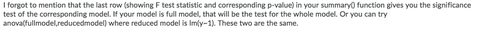
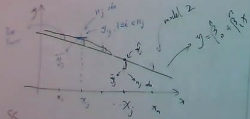

```{r,echo=F, message=F}
library(dplyr)
library(kableExtra) # create nice looking tables 
library(readxl) # read excel tables 
library('car')
library('faraway')
library(qpcR) # PRESS statistic
library(MASS) # boxcoxResult and boxcox()
library(nlme) # gls()
```

# About

These are class notes and R code for Professor Ge Zhao's STAT-464 : Applied Regression Analysis for Fall term 2021 at Portland State University. 

$\newcommand{\indep}{\perp \!\!\! \perp}$

# W1-D1 : Mon. Sept. 27, 2021

- will ask around for a bigger room 

- assume we have basic understanding of R 

## Introduction : Chapter 1 

- We want to know if the data matches (1-1), (1-Many), (Many - Many) and such 

- We call the data we are interested in the response $Y$ or sometimes the independet variable 

  - want to see what happens to y and the change of Y (predict Y)
  
  - examples : price of bitcoin, or price of house 

- We call the $X$ the predictor(s)

- want to use prediction to predict a response 

  - view of the model 
  
  - annalyze a model 
  
  - example (bitcoin) : day 1 = \$50, day 2 = \$100, day 3 = \$1,000
  
- math model is a statistical model, and to firgue out $Y=f(x)+\epsilon$ where $\epsilon$ is random error

  - in math model everything is fixed except for the $\epsilon$
  
  - this is a very general problem (tells almost nothing)
  
```{r, echo=F}
X <- c("continuous", "categrorical : ordinal data and nominal data")
Y <- c("continuous", "categorical : ordinal data and nominal data")

data.frame(X,Y) %>% kable() %>% kable_paper
```
- ordinal data (can be ordered) and nominal data (different types of data)"

- in regression class most of the time we are focuses on X=Y : Continuous vs Continuous 

- in experimental design we are focused on Y=X : Continuous vs Categorical 

- special case (in later chapters) Y=X : Ordinal vs. continuous 

- later (in other classes) we may see (double line) experimental design looks at every combination of categorical vs. categorical .

### Summary / Thoughts

We are focusing on data, and relations between $X$ and $Y$. 

Regressions would have continuous vs. continuous. This reminds me graphically of physics problems. How far does something go in a certain amount of time. 

Experimental design would have a continuous $Y$ vs. a Categorical $X$. Graphically I think of histograms. 

Some of the special cases I would need to think about. 

# W1-D2 : Wed. Sept. 29, 2021

- If you cannot attend in person use zoom number in D2L link 

### Simple Linear Regression Model 

A model with a single regressor (predictor) x that has a relationship with a response y that is a straight line line. $$y=\beta _{0}+\beta _{1}x+\epsilon$$

- $x$ is the data, $\beta _{0}$ is the intercept, $\beta _{1}$ is the slope, and $\epsilon$ is a random error component. 

  - $\beta$ unknown constants (parameters)
  
  - x is independent variable (predictor or regressor) and y is dependent variable (response).
  
  - simple because there is only one regressor (x).
  
  - the slope $\beta_{1}$ is the change in the mean of the distribution of y produced by a unit change in x.
  
  - example might be $x_1$ = pulse rate (rest rate), and $y$ might be oxygen consumption rate (oxygen rate)

- data points don't fall on a straight line so we can quantify the distances between each point and the best fit line

- $\epsilon$ is assumed to have an expectation or mean of 0 and an unknown variance $\sigma ^{2}$.

Why can you make the assumption that the expectation of $\epsilon$ is zero? 

- The expectation of a random variable must be a fixed random variable (number) whose derivative would be 0.

- can always absorb +c into $\beta$

- $\epsilon _{i}$ are uncorrelated from observation to observation 

### Mean and Variance of SLR

$$E(y|x)=\mu_{x|y}=E(\beta _{0}+\beta _{1}x+\epsilon)=\beta _{0}+\beta_{1}x$$

- $E(y|x)$ referes to the mean _y_ conditional on a specific value of _x_. 

$$Var(y|x)=\sigma^{2}_{y|x}=Var(\beta _{0}+\beta _{1}x+\epsilon)=\sigma^{2}$$

- homogenous variance assumption 

### Least-Square Estimation 

Suppose we have $n$ pairs of data : $(y_{1},x_{1}),(y_{2},x_{2}),...,(y_{n},x_{n})$. Then for a single point $$y_{i}=(\beta _{0}+\beta _{1}x+\epsilon_{i})$$

<center>

OR

</center>

$$\epsilon_{i}=y_{i}-\beta _{0}-\beta _{1}x$$

The idea is to minimize variations (the size of $\epsilon_{i}$), by taking the minimum : 

$$\min\limits_{\beta_{0},\beta{1}}=\sum_{i=1}^n[y_{i}-\beta _{0}-\beta _{1}x_{i}]^{2}$$

$$S(\beta_{0},\beta{1})=\sum_{i=1}^n[y_{i}-\beta _{0}-\beta _{1}x_{i}]^{2}$$

- when the value is squared it will not be canceled with itself 

Optimize by taking the derivative, set that to zero, and solve

$\Rightarrow$ Take partial derivatives

$$\frac{\partial S}{\partial \beta_{0}}=\sum_{i=1}^{n}-2[y_{i}-\beta _{0}-\beta _{1}x_{i}]$$

$$\frac{\partial S}{\partial \beta_{1}}=\sum_{i=1}^{n}-2x_{i}[y_{i}-\beta _{0}-\beta _{1}x_{i}]$$

$\Rightarrow$ set both equations equal to 0

$$\sum_{i=1}^{n}y_{i}-\sum_{i=1}^{n}\beta _{0}-\sum_{i=1}^{n}\beta _{1}x_{i}=0$$

$$\sum_{i=1}^{n}y_{i}x_{i}-\sum_{i=1}^{n}\beta _{0}x_{i}-\sum_{i=1}^{n}\beta _{1}x_{i}^{2}=0$$

### Summary 

- Class notes are difficult to see and hear, but follow the online notes from another student from a past term. Will try to stay in front of reading both textbook and old notes before class period. Will need to spend some time everyday on this class. 

- Data = Model + Error , where error is a deviation from the model 

- Discussed Simple Linear Regression Model, Expectation (mean), and variance, as well as the least squares estimate

- $\beta_{0}$ is the intercept, and $\beta_{1}$ is the slope

# W1-D3 : Fri. Oct. 1st, 2021

### Properties of least squares estimates

Today we will prove ??? 


This is the SSR form 

$$\min\limits_{\beta_{0},\beta{1}}=\sum_{i=1}^n[y_{i}-\beta _{0}-\beta _{1}x_{i}]^{2}$$


$\overline{xy}$ is **not** $x*y$ but the area


- rewrite solutions :
  - cancle out n's
  - multiple $\overline{x}^{2}$  
  - cancle the terms with beta 0 
  
$\beta_{1}\{\overline{x}^2-\{\overline{x}\}^{2}\}=\overline{xy}-\overline{x} \cdot\overline{y}$

From (1) we can have relationship $\beta_{0}=\overline{y}-\beta_{1}\overline{x}$


...

12:03

$\hat{\beta}=\frac{\overline{xy}-\overline{x} \cdot\overline{y}}{\overline{x}^{2}-\{\overline{x}\}^{2}}=\frac{\sum}{\sum}$

### Summary

- Trying to follow along with proofs that I can't see isn't working. 

- If time this term, it wouldn't hurt to revist these lectures and try to fill out these notes. 

- [October 1](http://web.pdx.edu/~gibson25/564/564-lecture-notes.html#12_-_october_1,_2020) should be the proof we did today. 

# W2-D4 : Mon. Oct. 4th, 2021

### R code lm()

lm(response ~ predictor, data = data)

- next chapter we will have several precidtors (where we will use +)

- lm() includes most of the important information and bottom part tells us how good our model is (Residual s.e., Multiple R-squared, F-statistic)

Final / Midterm will have coding at the end (like appendix), but in homework keep code output and explanation answering the question

### Properties of least squares estimates

### 1. least square estimates are linear combinations of y_i

$$\hat{\beta}_1=\frac{\sum\limits_{i=1}^n(x_i-\overline{x})y_i}{\sum\limits_{i=1}^n(x_i-\overline{x})^2}$$

$$\hat{\beta}_0=\overline{y}-\overline{x}\cdot\hat{\beta}_1$$

1. $\hat{\beta}_1$ and $\hat{\beta}_0$ are linear combinations of $y_{i}$'s

\begin{equation}\label{beta_1 linear to y}
\begin{split}
\hat{\beta}_1 & = \frac{\sum\limits_{i=1}^n(x_i-\overline{x})y_i}{\sum\limits_{i=1}^n(x_i-\overline{x})^2}\\
& = \sum\limits_{i=1}^n\frac{(x_i-\overline{x})}{\sum\limits_{i=1}^n(x_i-\overline{x})^2}y_i\\
& = \sum\limits_{i=1}^n\omega_iy_i\quad\text{where }\omega_i=\frac{(x_i-\overline{x})}{\sum\limits_{i=1}^n(x_i-\overline{x})^2}
\end{split}
\end{equation}

- can think of as a weight 

- don't care about x because it has a term, but y is random from epsilon 

\begin{equation}\label{beta_o linear to y}
\begin{split}
\hat{\beta}_0 & = \hat{\beta}_0=\overline{y}-\overline{x}\cdot\hat{\beta}_1\\
& = \frac{1}{n}\sum\limits_{i=1}^ny_i-\overline{x}\cdot\sum\limits_{i=1}^n\omega_iy_i\\
& = \sum\limits_{i=1}^n(\frac{1}{n}-\overline{x}\omega_i)y_i
\end{split}
\end{equation}

### 2. least squares estimators are unbiased of parameters 

2. $\hat{\beta}_1$ and $\hat{\beta}_0$ are unbiased estimators of $\beta_1$ and $\beta_0$ 

- the expectation of $\hat{\beta}_1$ and $\hat{\beta}_0$ are unbias estimators 

  - meaning if we repeat many times then the average will be the truth 

- this means estimators are good because it wont be far from the truth 

### Proof that expectations of estimators equals parameters 

We need to prove that $E[\hat{\beta}_{0}]=\beta_{0}$ and $E[\hat{\beta}_{1}]=\beta_{1}$

First assume that $E[\hat{\beta}_{1}]=\beta_{1}$. 

- we are using property number 1 becase if the expectation is a linear function then constants can move inside and outside expectation : $E(a\cdot X+b\cdot Y)=aE(X)+bE(Y)$

- note we normally we use lower case letter for numbers we know and upper case for those which are random. The y below is capitalized because it is random and unknown (because of epsilon). 

\begin{equation}\label{estimators expectation proof}
\begin{split}
E[\hat{\beta}_{1}] & = E{\sum\limits_{i=1}^n\omega_iY_i}\\
& = \sum\limits_{i=1}^n\omega_iE(Y_i)\\
& = \sum_{i=1}^{n}\omega_i(\beta_{0} +\beta_{1}x_{i})\\
& = \sum_{i=1}^{n}\omega_i\beta_{0}+\sum_{i=1}^{n}\omega_i\beta_{1}x_{i}\\
& = \beta_0\sum_{i=1}^{n}\omega_i+\beta_{1}\sum_{i=1}^{n}\omega_ix_{i}\\
& = 0 + \beta_1\cdot 1\\
& = \beta_1
\end{split}
\end{equation}

Therefore by the proof of equalities $E[\hat{\beta}_{1}]=\beta_{1}$. QED. 

Note : $\omega_i=\frac{(x_i-\overline{x})}{\sum\limits_{i=1}^n(x_i-\overline{x})^2}=\frac{1}{\sum\limits_{i=1}^n(x_i-\overline{x})^2}\sum\limits_{i=1}^n(x_i-\overline{x})$ (same form as last Friday)

- this is tricky, but key part of linear model 

Also Remember 

- y : not random, Y : random 

- cannot assume x to be random because it is apart of the observed data 

### Summary 

Properties of Least Squares Estimators: 

1. $\hat{\beta}_1$ and $\hat{\beta}_0$ are linear combinations of $y_{i}$

2. $\hat{\beta}_1$ and $\hat{\beta}_0$ are unbiased estimators of $\beta_1$ and $\beta_0$

- Which means : $E[\hat{\beta}_{0}]=\beta_{0}$ and $E[\hat{\beta}_{1}]=\beta_{1}$

# W2-D5 : Wed. Oct. 6th, 2021

- there is a 300 level version of this course

- next we show we can compute the variance of $\hat{\beta}_1$ and $\hat{\beta}_0$. 

### Properties of LSE

- LSE : $\hat{\beta}_1$ and $\hat{\beta}_0$

### 3. Variance of LSE

3. The variance of $\hat{\beta}_1$ and $\hat{\beta}_0$

**<span style="color: violet;">Assumptions (to simplify the model) </span>**

$E(\epsilon )=0$

$Var(\epsilon)=\sigma^2$

$\epsilon_i$ and $\epsilon_j$ are independent. ($\epsilon_i \ne \epsilon_j$)

$E(\epsilon_i\cdot\epsilon_j)=0$

$Cov(\epsilon_i\cdot\epsilon_j)=0$

Note : the only term with randomness is $\hat{y}$

\begin{equation}\label{var of slope estimate}
\begin{split}
Var[\hat{\beta}_{1}] & = Var\{\sum_{i=1}^{n}\frac{x_{i}-\overline{x}}{S_{xx}}Y_{i}\}^2\\
& = \sum_{i=1}^{n}Var\{\frac{x_{i}-\overline{x}}{S_{xx}}Y_{i}\}^2+(\text{Cov.})\\
& = \sum_{i=1}^{n}Var\{\frac{x_{i}-\overline{x}}{S_{xx}}Y_{i}\}^2\\
& = \sum_{i=1}^{n}\{\frac{x_{i}-\overline{x}}{S_{xx}}\}^{2}Var(Y_{i})^2\\
& = \sum_{i=1}^{n}\{\frac{x_{i}-\overline{x}}{S_{xx}}\}^{2}\sigma^2\\
& = \frac{\sigma^2}{S_{xx}^2}\sum_{i=1}^{n}(x_{i}-\overline{x})^2\\
& = \frac{\sigma^2}{S_{xx}}
\end{split}
\end{equation}

\begin{equation}\label{var of intercept estimate}
\begin{split}
Var[\hat{\beta}_{0}] & = Var(\overline{Y}-\hat{\beta}_1\overline{x})\\
& = Var\{\frac{1}{n}\sum_{i=1}^{n}Y_{i}-\overline{x}\sum_{i=1}^{n}\frac{x_{i}-\overline{x}}{S_{xx}}Y_i\}^2\\
& = Var[\sum_{i=1}^{n}\{\frac{1}{n}-\overline{x}\frac{(x_{i}-\overline{x})}{S_{xx}}\}Y_i]^2\\
& = \sum_{i=1}^{n}Var\{\frac{1}{n}-\overline{x}\frac{(x_{i}-\overline{x})}{S_{xx}}\}^2Y_i\\
& = \sum_{i=1}^{n}\{\frac{1}{n}-\overline{x}\frac{(x_{i}-\overline{x})}{S_{xx}}\}^2\sigma^2
\end{split}
\end{equation}

- remember that $\beta_{0}$ is y intercept 

### Sum of residuals is zero

4. $e_{i}=y_i+\hat{y}_i$

> $\sum_{i=1}^{n}e_i=0$
> 
> $\sum_{i=1}^{n}u=\hat{y}_i$

- proof is simple (and will be added to homework) : just plug in $\hat{y}_i$ and things will cancel 

- make sure to show results of one to be true before using it to prove the other

### Least Squares goes through the centroid of the data

5. $\overline{y}=\hat{\beta}_0+\hat{\beta}_1\overline{x}$

- centroid is $(x_i,y_i)_{i=1}^n$

- proof is simple just plug in estimator 

### LS Weighted by the corresponding fitted value equals zero 

6. $\sum_{i=1}^{n}x_ie_i=0$ and $\sum_{i=1}^{n}\hat{y}_ie_i=0$

> $\sum_{i=1}^{n}x_ie_i=0$
>
> $\sum_{i=1}^{n}\hat{y}_ie_i=0$

- need to expand to prove

- will be additional homework problem 

- residual is particular to x

- residual is particular to $\hat{y}$

- $x_i$ and $\hat{y}_i$ are 1 dimennsional vectors 

### Is this the correct line? 

- Original problem : When we assume a linear model how do we know we are using the correct line? 

- Is our assumption correct? 

- Is the model useful? 

- We do not know the parameters ($beta_0$ and $\beta_1$) (intercept and slope) so we estimated them 

- The answer will be an inference, but before we can make that inference we neet to estimate $\sigma^2$

- In most real life cases we do not know $\sigma^2$

### Estimating sigma squared 

Recall $e=y-\hat{y}$ 

$\sigma^2=Var(\epsilon)$

$\epsilon = Y -(\beta_0+\beta_1x)$

$e=y-(\hat{\beta}_0+\hat{\beta}_1x)=y-\hat{y}$

- idea is that we use the residuals to estimate the variance of error

Lets define these two quantities : 

$SS_{Res}=\sum\limits_{i=1}^{n}e^2_i=\sum\limits_{i=1}^{n}(y-\hat{y})^2$

$E(\sum\limits_{i=1}^{n}e^2)=(n-2)\sigma^2$

$\Rightarrow \sigma^2=\frac{E(\sum\limits_{i=1}^{n}e^2)}{n-2}$

- we don't know the true sigma, so we use this quantity to estimate sigma squared 

$\hat{\sigma}^2=\frac{\sum\limits_{i=1}^{n}e^2}{n-2}$

- because if we take the expectation of both sides we will have sigma squared 

$E(\hat{\sigma}^2)=E(\frac{\sum\limits_{i=1}^{n}e^2}{n-2})=\sigma^2$

- will be used a lot in the future

- note that this estimate is model dependent 

- in textbook as $MS_{\text{Res}}$ and sometimes called residual mean square

- square root of sigma squared sometimes called standard error of regression

### Summary 

- homework due monday 

- skip problems that deal with confidence interval 

- will go over some of the coding in class

- There are 6 properties of our least squares estimators $\hat{\beta}_0$ and $\hat{\beta}_1$

1. $\hat{\beta}_1$ and $\hat{\beta}_0$ are linear combinations of of the observations $y_{i}$

2. $\hat{\beta}_1$ and $\hat{\beta}_0$ are unbiased estimators of $\beta_1$ and $\beta_0$ 

3. Variance of LS estimates $\hat{\beta}_0$ and $\hat{\beta}_1$

- $Var[\hat{\beta}_{1}]=\frac{\sigma^2}{S_{xx}}$

- $Var[\hat{\beta}_{0}]=\sum\limits_{i=1}^{n}\{\frac{1}{n}-\overline{x}\frac{x_{i}-\overline{x}}{S_{xx}}\}^2\sigma^2$

4. Sum of residuals is zero

- $e_{i}=y_i+\hat{y}_i$

- $\sum\limits_{i=1}^{n}e_i=0$
 
- $\sum\limits_{i=1}^{n}u=\hat{y}_i$

5. LS goes through the centroid of the data

- $\overline{y}=\hat{\beta}_0+\hat{\beta}_1\overline{x}$

6. LS, Weighted by the corresponding fitted value, equals zero 

- $\sum\limits_{i=1}^{n}x_ie_i=0$ and $\sum_{i=1}^{n}\hat{y}_ie_i=0$

Estimate sigma^2 : $\hat{\sigma}^2=\frac{\sum\limits_{i=1}^{n}e^2}{n-2}$

# W2-D6 : Fri. Oct. 8th, 2021

- will go over coding in R 

- update R studio and packages 

- plan B : just use code in R (instead of Rmd) ... ?

- will upload html to D2L

- everything covered in class is covered in code (gray boxes)

- want to double check result with correct answer look for white boxes

- no actual help on homework, but we will see what happens I guess

### Hypothesis Testing 

- $\hat{y}=\hat{\beta}_0-\hat{\beta}_1\overline{x}$ is the estimated Y with estimated parameters 

- Why wouldn't our professor believe this : $Y=\beta_0+\beta_1x+\epsilon$, but would beleive this : $Y=\epsilon$?

- Recall that E($\epsilon$)=0 and VAR($\epsilon$)=$\sigma^2$ are unknown. 

- How do we know which Y is correct? 

- What is the difference between $\beta_1=0$ and $\beta_0=0$ OR $\beta_1\ne0$ and $\beta_0\ne0$

- If $\beta_1$ is zero then x shouldn't be included in the model. 

- $H_0=\beta_1=0$, $\beta_0=0$

- $H_0=\beta_1\ne0$, $\beta_0\ne0$

Question 1 : Do we really need x to explain y? 

- in math language : $\beta_1=0$

... to be continued next class. 

### Summary 

- finish homework (complete)

# W3-D7 : Mon. Oct. 11th, 2021

- 2 proofs are due for homework 2 

### Section 2.3 Hypothesis testing on parameters 

- $H_0$ : $\beta_1=0$ and $H_1$ : $\beta_1\ne0$

- we want to test if a statement is true or not 

- if $H_0$ is true then our model : $Y=\beta_0+\beta_1x+\epsilon$ has nothing to do with x. 

  - meaning that Y is just a constant plus $\epsilon$
  
  - can't get any information from model 
  
  - this is a very strong statement 
  
  - and our testing problem 
  
### t-statistic

- Recall $\epsilon_i\sim N(0,1)$ and that $\epsilon_i$ and $\epsilon_j$ are independent with $i\ne j$

- If we have the assumption that $\epsilon_i$ is independent and identically distributed, then 

$$t=\frac{\hat{\beta}_1-\hat{\beta}_{10}}{se(\hat{\beta}_{10})\}}\sim t_{n-1}$$
  
- this ratio is the t statistic exzactly

- n-2 because there are two parameters 

- later there will 3 up to p parameters

- Proof for this depends on $\chi^2$ (chi squared distribution) 

- se is squared root varience 

- Initially we assume that $H_0$ is true ($\beta_1=0$), but if z value is large then $H_1$ may be false

- $t=\frac{\hat{\beta}_1-\hat{\beta}_{10}}{se(\hat{\beta}_{10})}$ is called the "tester statistic" 

  - if $H_0$ is true then t is close to 0
  
  - if $H_0$ is false then t is further away (closer to 1)
  


- img. above is pdf of t-distribution 

- p-value = 2(area1) = 2(area2) = $2Pr(T>t)=Pr(T>|t|)$

- p value is the probability (between 0 and 1) that $H_0$ is true.

- a p-value that is < significance level (usually 0.05), the we reject $H_0$. 

  - (accepting $H_1$)
  
  - example : P value of 0.00000000005 we can reject 
  
- a p-value that is > significance level (usually 0.05), then we fail to reject $H_0$.

  - not deterministic result 
  
  - note p-value is only the probability
  
  - if we accept $H_1$ then we say it is true, which is not the case
  
  - example : P value of 0.25 we fail to reject 
  
- consider p-value as uncertainty 
  
### Special Case (sigma squared is known)

- $\sigma^2$ is known (happens in some homework problems)

- "ideal case" 

- $t=\frac{\hat{\beta}_1-\hat{\beta}_{10}}{se(\hat{\beta}_{10})\}}\sim N(0,1)$

### One sided Test 

- A two sided test is what we were looking at before. 

- Often Written : $H_0$ : $\beta_0=\beta_{10}$ vs. $H_1$ : $\beta_0\ne\beta_{10}$

- A one sided test is : $H_0$ : $\beta_0=\beta_{10}$ vs. $H_1$ : $\beta_0>\beta_{10}$

- if test is one sided, then it will depend which side the p-value is on 

- only one side is being counted ($\frac{1}{2}$ Area)

### Summary 

- will revisit t (and maybe prove in a different form)

- update code page

- create homework page? 

- fill in holes in notes 

- finish chapter 2 

- peek at chapter 3

# W3-D8 : Wed. Oct. 13th, 2021

- this next section follows the book (something to do with $R^2$)

### Analysis of Variance 

$\sum\limits_{i=1}^{n}(y_i-\overline{y})^2$

- SSTO = Sum Square Total

- when we calculate simple variance of $y_i$ we use this formula 

- sometimes we might have a $\frac{1}{n}$ or some other constant in front of the sigma, but we can forget about that 

- the data point ($y_i$) minus the center point ($\overline{y}$)

  - the distance between the point and data mean (visualize graphically)
  
- we will decompose this into two parts 

$\sum\limits_{i=1}^{n}(y_i-\overline{y})^2=\sum\limits_{i=1}^{n}(y_i-\hat{y}_i)^2+\sum\limits_{i=1}^{n}(\hat{y}_i-\overline{y})^2$

- the first part is the residual : $\sum\limits_{i=1}^{n}(y_i-\hat{y}_i)^2$

  - SSE : Sum Square of Error
  
  - if our model perfectly fits the data then $\hat{y}$ will be $y_i$ and residual will be zero
  
  - $SS_{RE}$

- the second part is variability of fitted data (SSR): $\sum\limits_{i=1}^{2}(\hat{y}_i-\overline{y})^2$

  - $\overline{\hat{y}}=\overline{y}$ : average of estimated y is the same as the original value 
  
  - SSR : Sum Square of Regression 
  
  - $SS_{Reg}$
  
- everything is decomposing this : $\sum\limits_{i=1}^{n}(y_i-\overline{y})^2$ variance
  
  - this means that the variance of the data ($\sum\limits_{i=1}^{n}(y_i-\overline{y})^2$) can be explained by the variance of the error ($\sum\limits_{i=1}^{n}(y_i-\hat{y}_i)^2$) and the variance of model ($\sum\limits_{i=1}^{2}(\hat{y}_i-\overline{y})^2$)
  
  ### Proof : Analysis of Variance 
$\sum\limits_{i=1}^{n}(y_i-\overline{y})^2=\sum\limits_{i=1}^{n}(y_i-\hat{y}_i)^2+\sum\limits_{i=1}^{2}(\hat{y}_i-\overline{y})^2$ is true. 

\begin{equation}\label{analysis of var. proof part a}
\begin{split}
\sum\limits_{i=1}^{n}(y_i-\overline{y})^2 & = \sum\limits_{i=1}^{n}(y_i-\hat{y}_i)^2+\sum\limits_{i=1}^{2}(\hat{y}_i-\overline{y})^2\\
& = \sum\limits_{i=1}^{n}(y_i-\hat{y}_i+\hat{y}_i-\overline{y})^2\\
& = \sum\limits_{i=1}^{n}\{(y_i-\hat{y}_i)^2+(\hat{y}_i-\overline{y})^2+2(y_i-\hat{y}_i)(\hat{y}_i-\overline{y})\}
\end{split}
\end{equation}

What we need to show is that this term : $(y_i-\hat{y}_i)(\hat{y}_i-\overline{y})$ , is zero. 

- $\sum\limits_{i=1}^n(y_i-\hat{y}_i)(\hat{y}_i-\overline{y}) = 0$

\begin{equation}\label{aov lemma}
\begin{split}
\sum\limits_{i=1}^{n}(y_i-\hat{y}_i)(\hat{y}_i-\overline{y}) & = \sum\limits_{i=1}^n(y_i-\hat{y}_i)\hat{y}_i-\sum\limits_{i=1}^n(y_i-\hat{y}_i)\overline{y}\\
& = \sum\limits_{i=1}^ne_i\hat{y}_i-\overline{y}\sum\limits_{i=1}^ne_i\\
& = 0 - 0\\
& = 0
\end{split}
\end{equation}

- note to show that $\sum\limits_{i=1}^ne_i\hat{y}_i=0$ write out each of the individual terms for $\hat{y}_i$ and $e_i$

Therefore $\sum\limits_{i=1}^n(y_i-\hat{y}_i)(\hat{y}_i-\overline{y}) = 0$ , and such $\sum\limits_{i=1}^{n}(y_i-\overline{y})^2=\sum\limits_{i=1}^{n}(y_i-\hat{y}_i)^2+\sum\limits_{i=1}^{2}(\hat{y}_i-\overline{y})^2$

### Degrees of Freedom 

- in probability theory we need to look at the degrees of freedom : df

  - for SSTO :  df = n - 1
  
  - for SSE : df = n-2
  
    - $\hat{\beta}_0$ and $\hat{\beta}_1$

  - for SSR : df = 1

### Decomposing terms : SSE , SSR , MSE 

$1=\frac{SSE+SSR}{SSTO}=\frac{SSE}{SSTO}+\frac{SSR}{SSTO}$

- SSTO is fixed 

- $+\frac{SSR}{SSTO}$ is $R^2$ (we will talk more about $R^2$ when we talk about the confidence interval)

- $\frac{SSE}{SSTO}$ is 

- we use SSE to estimate the variance

  - once we have variance we can show probability, density, or distribustion of almost anything 

$SSE=\frac{n-2}{\sigma^2}\sim x^2_{n-2}$

  - chi squared n - 2 distribution 
  
  - $\frac{SSE}{\sigma^2}=MSE\frac{n-2}{\sigma^2}$

$SSR=1\cdot MSR\sim x_1^2$

  - chi squared 1 distribution 

  - $\frac{SSR}{\sigma^2}=1\cdot \frac{MSR}{\sigma^2}$

$E(MSE)=\sigma^2$

> $MSE=\frac{1}{n-2}\sum\limits_{i=1}^n(y_i-\hat{y}_i)^2$

$MSE=\frac{SSE}{n-2}$

$MSE=\frac{SSE}{\text{df of SSE}}$

$MSR=\frac{SSR}{\text{df of SSR}}$

### F and  T Statistic 

What happens when we take one and divide it by another one? 

- put the smaller one (degrees of freedom) ontop of the larger one

$\sqrt{\frac{MSR}{MSE}}=\frac{1\cdot\frac{MSR}{\sigma^2}}{MSE\frac{n-2}{\sigma^2}}=\frac{MSR}{(???)MSE}=\frac{\chi_1^2/1}{\chi_{n-2}^2/n-2}$

F statistic : $F_{1, n-2}\sim \frac{\chi_1^2/1}{\chi_{n-2}^2/n-2}$

$\frac{\chi^2_m/m}{\chi_n/n}\sim F_{m,n}$ , if $\chi^2_n$ is  (independent) from $\chi^2_m$ then 

  - $\newcommand{\indep}{\perp \!\!\! \perp}\chi^2_n\indep \chi^2_m$
  
We have another problem ... what about T distribution? 

$T\sim df_n$

What is $T^2$ distribution? 

- $T^2\sim F_n$

We can change these : $T\sim df_{n-2}$ and $T^2\sim F_{n-2}$

### Key Points

- The analysis equations is the most critical result 

- we also decompose this equation into many terms, with each term responding to error , regresseion with ... a bunch of stuff. 

- if we find that any term is too small to consider we can remove it (here is only two parts so not very complex)

Test : $\beta_1=0$ vs. $\beta_1\ne0$

### Confidence Interval of parameter

Pr($1,\beta_1<\mu=1-\alpha)=<\alpha\ne1$

- of course we want this probability to be 1

- currently we dont know if this is the number we have or not 

- next we are going to try to connect bact to $1-\alpha$

- probability of random vairable : $\beta_1$ is computed here

$t=\frac{\hat{\beta}_1-\beta_1}{s.e.(\hat{\beta}_1)}\sim t_{n-2}$

- distribution of $\beta_1$ is defined here 

Can we solve for our $\mu$? 

- if we can we can find the interval for $\beta_1$

- we will do this this Friday. 

### Summary 

- analysis of variance : $\sum\limits_{i=1}^{n}(y_i-\overline{y})^2=\sum\limits_{i=1}^{n}(y_i-\hat{y}_i)^2+\sum\limits_{i=1}^{n}(\hat{y}_i-\overline{y})^2$

- SSTO : sum of squares total : $\sum\limits_{i=1}^{n}(y_i-\overline{y})^2$

- SSE : sum of square error : $\sum\limits_{i=1}^{n}(y_i-\hat{y}_i)^2$

- SSR : sum of square regression : $\sum\limits_{i=1}^{n}(\hat{y}_i-\overline{y})^2$

- MSE : mean square error (??) : $MSE=\frac{1}{n-2}\sum\limits_{i=1}^n(y_i-\hat{y}_i)^2$

- F Statistic : $\frac{\chi^2_m/m}{\chi_n/n}\sim F_{m,n}$

- T Statistic : $T^2\sim F_{n-2}$

- Confidence interval for $\beta_1$'s 

  - probaility : Pr($1,\beta_1<\mu=1-\alpha)=<\alpha\ne1$
  
  - distribution : $t=\frac{\hat{\beta}_1-\beta_1}{s.e.(\hat{\beta}_1)}\sim t_{n-2}$
  
- HW 2 is live : Proofs and fill in skipped questions from HW 1

# W3-D9 : Fri. Oct. 15th, 2021

- Problem is that we want to find the confidence interval (CI) for parameters $\beta_0$ and $\beta_1$, and $\sigma^2$

### CI For Beta_0 , Beta_1, and Sigma Squared

$Pr\{l<\beta_1<u\}=1-\alpha$

- we want probability that $\beta_1$ is greater than some lower bound and less than some upper bound is equal to some number, lets call alpha for now

- currently we don't know the lower and the upper 

  - we do know $t=\frac{\hat{\beta}_1-\beta_1}{s.e.(\hat{\beta}_1)}\sim t_{n-2}$ 
  
  - which is a different form of $\beta_1$
  
  - call this ratio t

- we also don't know the distribution of $\beta_1$. If we did we knew that we would know the probability and be able to find the lower and upper bounds. 

\begin{equation}\label{pr beta 1}
\begin{split}
1-\alpha & = Pr\{l<\beta_1<u\}\\
& = Pr\{-u<-\beta_1<-l\}\\
& = Pr\{\hat{\beta}_1-u<\hat{\beta}_1-\beta_1<\hat{\beta}_1-l\}\\
& = Pr\{\frac{\hat{\beta}_1-u}{s.e.(\hat{\beta}_1)}<\frac{\hat{\beta}_1-\beta_1}{s.e.(\hat{\beta}_1)}<\frac{\hat{\beta}_1-l}{s.e.(\hat{\beta}_1)}\}
\end{split}
\end{equation}

- now the probabilty becomes : 

$Pr(\frac{\hat{\beta}_1-u}{s.e.(\hat{\beta}_1)}<t<\frac{\hat{\beta}_1-l}{s.e.(\hat{\beta}_1)})=1-\alpha$

- we know t-distribution, so if we can figure our $\hat{\beta}_1$ and $s.e.(\hat{\beta}_1)$ then we can find upper and lower bounds 


- we have and even distribution with evenly distanced intevals a and -a 

- we know the area between these two points is $1-\alpha$

- that means the area of ends is $\frac{\alpha}{2}$

- $a=t_{\frac{\alpha}{2},n-2}$ , $t_{1-\frac{\alpha}{2},n-2}$ , $t_{n-2}^{\frac{\alpha}{2}}$

- plug in $a=t_{\frac{\alpha}{2},n-2}$ , then we have 

$\frac{\hat{\beta}_1-u}{s.e.(\hat{\beta}_1)}=-t_{\frac{\alpha}{2},n-2}$

$\Rightarrow u=\hat{\beta}_1+t_{\frac{\alpha}{2},n-2}\cdot s.e.(\hat{\beta}_1)$

$\Rightarrow l=\hat{\beta}_1-t_{\frac{\alpha}{2},n-2}\cdot s.e.(\hat{\beta}_1)$

- put this back in the original equation : $Pr\{l<\beta_1<u\}=1-\alpha$

- If we want a 99% confidence interval then our alpha needs to be 1%

- 95% CI, $\alpha=0.05$

For $Pr\{l<\beta_0<u\}=1-\alpha$ the CI are : 

$\Rightarrow u=\hat{\beta}_0+t_{\frac{\alpha}{2},n-2}\cdot s.e.(\hat{\beta}_0)$

$\Rightarrow l=\hat{\beta}_0-t_{\frac{\alpha}{2},n-2}\cdot s.e.(\hat{\beta}_0)$

### CI of Sigma Squared 

$\sigma^2$ ? 

$Pr\{l<\sigma^2<u\}=1-\alpha$

$\frac{(n-2)MSE}{\sigma^2}\sim \chi^2_{n-2}$

- this ratio is chi squared distribution with degrees of freedom n-2. wont prove but will need to know decompositions to prove

To help remember : 

$E(SSE)=(n-2)\sigma^2$

$MSE=\frac{1}{n-2}SSE$


- we are still looking for some interval c and d such that the blue area is $1-\alpha$. 

- area of a and b are : $a=\chi^2_{\frac{\alpha}{2},n-2}$ and $b=\chi^2_{1-\frac{\alpha}{2},n-2}$

$Pr\{\frac{(n-2)MSE}{u}<\frac{(n-2)MSE}{\sigma^2}<\frac{(n-2)MSE}{l}\}=1-\alpha$

- the lower probability is a and the upper probability is b so, 

$\Rightarrow u=\frac{(n-2)MSE}{\chi^2_{\frac{\alpha}{2},n-2}}$

$\Rightarrow l=\frac{(n-2)MSE}{\chi^2_{1-\frac{\alpha}{2},n-2}}$

- in this course we do not care too much for the CI of $\sigma^2$, but about the CI for $\beta_1$ and $\beta_0$

### Prediction 

- what people really want is the response, the prediction 

model : $Y=\beta_0+\beta_1x+\epsilon$

- $\beta_0+\beta_1x$ : first part is what we can determine (linear part). 

- $\epsilon$ : second part is something random, not in our control.

  - assume normal 

description : $\{x_i,y_i\}^n_{i=1}$

- $y_i=\hat{\beta}_0+\hat{\beta}_1x_i$
 
estimated model : $\hat{y}_i=\hat{\beta}_0+\hat{\beta}_1x$

point prediction :  $y_{\text{new}}=\hat{\beta}_0+\hat{\beta}_1x_{\text{new}}+\epsilon_{\text{new}}$

- dont know random unknown term $\epsilon_{\text{new}}$

We can comput the CI of $\hat{\beta}_0$ and $\hat{\beta}_1$

- key part of this is that the $Var(\hat{\beta}_0)$ and $Var(\hat{\beta}_1)$

 Now want the CI of $y_{\text{new}}$
 
- we already know $\hat{y}_{\text{new}}=???$ this is our hat estimate

- next step is $Var(y_{\text{new}})$ 

  - if we can compute the variance of y hat then we can compute our CI
  
###


- this is a straight line 

- given $x_{\text{new}}$ we can find our prediction on this straight line 

So what is $y_{\text{new}}$

- it should be somewhere along the blue line 

- so we will find an interval that 95% of the data lies within, that we can way with 95% confidence that $y_{\text{new}}$ lies within 

- $Var(y_{\text{new}})$ is so important because it will help us with calculations from earlier in lecture (for upper and lower values : u and l) 

\begin{equation}\label{var of y hat}
\begin{split}
Var\{y_{\text{new}}\} & = Var\{\hat{\beta}_0+\hat{\beta}_1x_{\text{new}}+\epsilon_{\text{new}}\}\\
& = Var\{\hat{\beta}_0+\hat{\beta}_1x_{\text{new}}\}+Var\{\epsilon_{\text{new}}\}\\
& = Var\{\hat{y}\}+\sigma^2
\end{split}
\end{equation}

What you need to do next is write out the formular for $\hat{y}$ and take the square root : $\sqrt{...\cdot\sigma^2}$

- will expand on the details on Monday 

- Homework expanded to Wednesday so we can do all predictions and confidence interval 

### Summary 

- will expand on prediction on monday 

For $Pr\{l<\beta_1<u\}=1-\alpha$ the CI are : 

$\Rightarrow u=\hat{\beta}_1+t_{\frac{\alpha}{2},n-2}\cdot s.e.(\hat{\beta}_1)$

$\Rightarrow l=\hat{\beta}_1-t_{\frac{\alpha}{2},n-2}\cdot s.e.(\hat{\beta}_1)$

For $Pr\{l<\beta_0<u\}=1-\alpha$ the CI are : 

$\Rightarrow u=\hat{\beta}_0+t_{\frac{\alpha}{2},n-2}\cdot s.e.(\hat{\beta}_0)$

$\Rightarrow l=\hat{\beta}_0-t_{\frac{\alpha}{2},n-2}\cdot s.e.(\hat{\beta}_0)$
3096/
For $Pr\{l<\sigma^2<u\}=1-\alpha$ the CI are : 

$\Rightarrow u=\frac{(n-2)MSE}{\chi^2_{\frac{\alpha}{2},n-2}}$

$\Rightarrow l=\frac{(n-2)MSE}{\chi^2_{1-\frac{\alpha}{2},n-2}}$

### To Do 

- prep homework 2 (complete)

# W4-D10 : Mon. Oct. 15th, 2021

CI of $\hat{\beta}_1$ , $\hat{\beta}_0$ , $\hat{\sigma}^2$

- once we know how to do the CI of these three then we can do the standard error of $s.e.\hat{\beta}_1$ and $s.e.\hat{\beta}_0$

Next we can find a predictor of y at $x_\text{new}$

$\hat{y}_\text{new}=\hat{\beta}_0+\hat{\beta}_1x_\text{new}$

- not at original x but new x, so new y 

- $\hat{y}_\text{new}$ is an estimation so we don't know how far away it is from $y_\text{new}$

- so we will use the CI to show that within a certain level of confidence the interval with include this 

### CI of y_new

$y_\text{new}=\hat{\beta}_0+\hat{\beta}_1x_\text{new}+\epsilon_\text{new}$

- there is an error term that corresponds to x new

- we don't know exact value of epsilon new

- that means y_new is random, so we can find Var(y_new)

$Var(y_\text{new})=Var(\hat{\beta}_0+\hat{\beta}_1x_\text{new}+\epsilon_\text{new})$

- $E(y_\text{new})=\beta_0+\beta_1x_\text{new}$

- now we have several different situations to solve for var

### 1. Only 1 x_new

1. Only one $x_{\text{new}}$

\begin{equation}\label{var of y hat full}
\begin{split}
Var\{y_{\text{new}}\} & = Var\{\hat{\beta}_0+\hat{\beta}_1x_{\text{new}}\{+Var\{\epsilon_{\text{new}}\}\\
& = \sigma^2\{\frac{1}{n}\frac{(x_{\text{new}}-\overline{x})^2}{S_{xx}}\}+\sigma^2\\
& = \sigma^2\{1+\frac{1}{n}\frac{(x_{\text{new}}-\overline{x})^2}{S_{xx}}\}
\end{split}
\end{equation}

$s.e.(\hat{y}_{\text{new}})=\hat{\sigma}\sqrt{1+\frac{1}{n}\frac{(x_{\text{new}}-\overline{x})^2}{S_{xx}}}$

We use : $\frac{\hat{y}_\text{new}-y_\text{new}}{s.e.(\hat{y}_\text{new})}\sim t_{n-2}$ to create the C.I. 

C.I. of $y_{\text{new}}$ is $\{\hat{y}_{\text{new}}\pm t_{}\cdot \sqrt{1+\frac{1}{n}+\frac{(x_{\text{new}}-\overline{x})^2}{s_{xx}}}$

- with 95% confidence that $y_\text{new}$ is in this interval

### 2. m identical x_new

2. m identical $x_{\text{new}}$

- What if we have many x's? 

$s.e.(\hat{y}_\text{new})=\hat{\sigma}\sqrt{\frac{1}{m}+\frac{1}{n}\frac{(x_{\text{new}}-\overline{x})^2}{S_{xx}}}$

> $Var(\frac{1}{m}\sum\limits_{i=1}^n\epsilon_{new})=\frac{1}{m}\sigma^2$

C.I. of $y_{\text{new}}$ is $\{\hat{y}_{\text{new}}\pm t_{\frac{\alpha}{2},n-2}\cdot \sqrt{\frac{1}{m}+\frac{1}{n}+\frac{(x_{\text{new}}-\overline{x})^2}{s_{xx}}}$

### 3. Infinite many x_new

3. Expected Prediction of $x_\text{new}$

- we are looking for expected y_new

- mean of many y-news

$s.e.(\hat{y}_\text{new})=\hat{\sigma}\sqrt{\frac{1}{n}+\frac{(x_{\text{new}}-\overline{x})^2}{s_{xx}}}$

- infinite means that m is positive infiniity, if you plug in then the first term is zero 

C.I. of $y_{\text{new}}$ is $\{\hat{y}_{\text{new}}\pm t_{\frac{\alpha}{2},n-2}\cdot \hat{\sigma}\sqrt{\frac{1}{n}+\frac{(x_{\text{new}}-\overline{x})^2}{s_{xx}}}$

- with 95% that the average of $y_\text{new}$ is in this interval 


### R

- prediction section in code is "stupid way" 

- triangle is $\hat{y}_\text{new}$ , which is on the straight line

  - C.I. are upper and lower dots
  
  - if expand then we have a confidence band
  
Code : 

function confint()

create new data, plug in data from orignial and assume new x 

function predict()

- assign interval 'prediction' and 'confidence' respectively 

- put them together and have a confidence band 

- wider band is argument 

- dashed curve is confidence of senario 3 

- always smaller than other curves

### Coefficient of Determination (R Squared)

- this is one way to measure how good our model is

$R^2=1-\frac{SSE}{SSTO}=\frac{SSR}{SSTO}$

- when comparing models the one with the larger $R^2$ is better

- models can be tuned to have the same $R^2$


- Model II and II should not be assumed linear models, but all three have the same $R^2$ 

- There is a better way to check from beginning if linear model is correct 

- Final model will be incorrect if initial assumption is incorrect 

- Wednesday we will cover a property of $R^2$ and start chapter 3

### Summary 

- C.I. of $y_\text{new}$

1. Only 1 $x_{\text{new}}$

- $\{\hat{y}_{\text{new}}\pm t_{}\cdot \sqrt{1+\frac{1}{n}+\frac{(x_{\text{new}}-\overline{x})^2}{s_{xx}}}$

2. m identical $x_{\text{new}}$

- $\{\hat{y}_{\text{new}}\pm t_{\frac{\alpha}{2},n-2}\cdot \sqrt{\frac{1}{m}+\frac{1}{n}+\frac{(x_{\text{new}}-\overline{x})^2}{s_{xx}}}$

3. Expected Prediction of $x_\text{new}$

- $\{\hat{y}_{\text{new}}\pm t_{\frac{\alpha}{2},n-2}\cdot \hat{\sigma}\sqrt{\frac{1}{n}+\frac{(x_{\text{new}}-\overline{x})^2}{s_{xx}}}$

Coefficient of Determination : $R^2=1-\frac{SSE}{SSTO}=\frac{SSR}{SSTO}$

### To do 

- complete todays notes (complete)

  - use t test (haven't covered f-test)
  
- read chapter 3 (begin on Wednesday)

- rewatch mon. Oct. 4th lecture (complete)

# W4-D11 : Wed. Oct. 20th, 2021

### R Squared 

$R^2$ 

- sometime we are interested in the relationship b/t Y and X 

$P=\frac{Cov(Y,X)}{\sqrt{Var(X)Var(Y)}}=\frac{E(XY)-E(X)E(Y)}{\sqrt{Var(X)Var(Y)}}$

- By definition of covariance we get the equation above 

- our sample variance will become r : (replace Expectation with average)

$r=\frac{\frac{1}{n}\sum\limits_{i=1}^nx_iy_i-(\frac{1}{n}\sum\limits_{i=1}^nx_i)(\frac{1}{n}\sum\limits_{i=1}^ny_i)}{\sqrt{\frac{1}{n}\sum\limits_{i=1}^n(x_i-\overline{x})^2-\frac{1}{n}\sum\limits_{i=1}^n(y_i-\overline{y})^2}}$

- next, try to connect this r with $R^2$ where,  

$R^2=\frac{SSR}{SSTO}=1-\frac{SSE}{SSTO}$

\begin{equation}\label{r=R^2}
\begin{split}
r & = \frac{\frac{1}{n}\sum\limits_{i=1}^nx_iy_i-(\frac{1}{n}\sum\limits_{i=1}^nx_i)(\frac{1}{n}\sum\limits_{i=1}^ny_i)}{\sqrt{\frac{1}{n}\sum\limits_{i=1}^n(x_i-\overline{x})^2-\frac{1}{n}\sum\limits_{i=1}^n(y_i-\overline{y})^2}}\\
& = \frac{\frac{1}{n}\{\sum\limits_{i=1}^nx_iy_i-\overline{x}\sum\limits_{i=1}^ny_i\}}{\frac{1}{n}\sqrt{\sum\limits_{i=1}^n(x_i-\overline{x})^2-\sum\limits_{i=1}^n(y_i-\overline{y})^2}}\\
& = \frac{\sum\limits_{i=1}^n(x_i-\overline{x})y_i}{\sqrt{S_{xx}-SSTO}}\\
& = \frac{\sum\limits_{i=1}^n(x_i-\overline{x})(y_i-\overline{y)}}{\sqrt{S_{xx}-SSTO}}\\
& = \frac{S_{xy}}{\sqrt{S_{xx}-SSTO}}
\end{split}
\end{equation}

- added minus $\overline{y}$ term, which by homework problem is zero so this doesn't change the original value

- now we can square the whole equation (but write the numerator seperated out)

$r^2=\frac{s_{xy}S_{xy}}{S_{xy}SSTO}=\hat{\beta}_1\cdot\frac{S_{xy}}{SSTO}$

- because $\frac{S_{xy}}{S_{xx}}=\hat{\beta}_1$

Next we are going to show $R^2=r^2$

- That means if $R^2=r^2$ is true then the coeifficient of the determination or the percentage of variability granted by our linear model. So this $R^2$ is actually the square of our sample correlation coefficient. 

- if it is not a linear model then $R^2=r^2$ truth doesn't exist


The next step is to show that $R^2=r^2$ is to show that $\hat{\beta}_1\cdot S_{xy}=SSR$

- for $R^2=r^2$ , then $\frac{SSR}{SSTO}=\hat{\beta}_1\cdot\frac{S_{xy}}{SSTO}$

\begin{equation}\label{r^2=R^2}
\begin{split}
\hat{\beta}_1\cdot S_{xy} & = \hat{\beta}_1\cdot \sum\limits_{i=1}^n(x_i-\overline{x})(y_i-\overline{y})\\
& = \sum\limits_{i=1}^n(\hat{\beta}_1x_i-\hat{\beta}_1\overline{x})(y_i-\overline{y})\\
& = \sum\limits_{i=1}^n\{\hat{y}_i-\hat{\beta}_o-(\overline{y}-\hat{\beta}_0)\}(y_i-\overline{y})\\
& = \sum\limits_{i=1}^n(\hat{y}_i-\overline{y})(y_i-\overline{y})\\
& = \sum\limits_{i=1}^n(\hat{y}_i-\overline{y})\{\hat{y}_i-\overline{y}+(y_i+\hat{y}_i)\}\\
& = \sum\limits_{i=1}^n(\hat{y}_i-\overline{y})(\hat{y}_i-\overline{y})+\sum\limits_{i=1}^n(\hat{y}_i-\overline{y})\cdot e_i\\
& = SSR+0
\end{split}
\end{equation}

- This term $\sum\limits_{i=1}^n(\hat{y}_i-\overline{y})(y_i-\overline{y})$ looks a lot like $SRR=\sum\limits_{i=1}^n(\hat{y}_i-\overline{y})^2$ (so then create a new term)

- proved yhat e_i and overline y e_i are 0 in homework 

- If X and Y have high correlation you will expect a high $R^2$

### Test if Correlation is 0 or not

- $H_0$ : $P=0$ vs. $H_1=P\ne0$

  - 0 means there is no relationship between X and Y
  
  - non 0 means there is a relationship between X and Y

- next we will create a test statistic 

Test statistic : 

$t=r\cdot \frac{\sqrt{n-2}}{\sqrt{1-r^2}}\sim t_{n-2}$ under $H_0$

For large sample size :

$z=\frac{1}{n}ln\frac{1+r}{1-r}\rightarrow N(\frac{1}{2}ln\frac{1+p}{1-p},\frac{1}{n-3})$

- we don't need this for this class, but to show we can test slope 

- chapter also includes other things but we will not discuss these in class such as : random predictor acts, and  Maximum Root Estimator. Read about those in the book

### Chapter 2.5 Basic Matrix 

- we have discussed 1 Y and and 1 X, now we will discuss situations with multiple x's, or predictors 

- will use matrix form 

- will not prove any result, so will mostly use result and properties of matrix 

- matrix will simplify notation sometimes, but it is not as straight forward as chapter 2 

- need several properties first 

### Properties 

Let A, B be matrix. x, y are column vector. a, b are constant, scalar perhaps. 

1. Rank of A : # of independent column vectors of A. 

2. Identity matrix I = \begin{equation}
I = 
\begin{matrix}
1 & 0 \\
0 & 1\\
\end{matrix}
\end{equation}

3. Inverse $AA^{-1}=A^{-1}A=I$

- assume A is invertible 

- will use square matrix

4. Transpose $(A^T)^T=A$ , $(AB)^T=B^TA^T$

5. Symmetric, $A^T=A$ 

- will use square matrix

6. Idempotent  matrix : $AA=A$

- will use square 

7. Orthogonal Matrix : $A^TA=I$ , which implies $A^{-1}=A^T$

8. Quadratic Form : $y^TAy=\sum\limits_{i=1}^n\sum\limits_{j=1}^na_{ij}\cdot y_i\cdot y_j$

- y is n-by-1

- A is n-by-n

9. Positive Definite (P.D.) and Positive Semidefinite (P.S.D.)

Assume $A^T=A$ 

P.D. $y^TAy>0$ for any $y\ne0$

- y is a vector so 0 is zero vector where all element are zero

P.S.D. $y^TAy\geq0$ for any $y\ne0$

10. Trace of A : trace(A) = tr(A)

- trace of A is trace of diagonal elements of A , $trace(A)=tr(A)=\sum\limits_{i=1}^na_{ii}$

- $tr(AB)=tr(BA)$

- $tr(ABC)=tr(CAB)$ (order doesn't matter or change the trace)

- $tr(aA+bB)=atr(A)+btr(B)$ (trace is linear function)

11. Rank of independent matrix A is the trace of A. Rank (A)=tr(A) if A is independent. 

12. Matrix Partition : $A=[A_1\quad A_2]$

- cut a matrix into two parts $A_1$ on the left and $A_2$ on the right 

- $A(A^TA)^{-1}A^TA_1=A_1$

- $A(A^TA)^{-1}A^TA_2=A_2$

- $A^T_1A(A^TA)^{-1}A^T=A^T_1$

- $A^T_2A(A^TA)^{-1}A^T=A^T_2$

- note that this is a very special matrix : $A(A^TA)^{-1}A^T$

  - this part is an idempotent matrix meaning that as a whole, it multiplied by itself it would be itself (middle terms will cancel out)

  - the result of this term is the also called the projection of the space spanned by A 

    - span from A : any vector term term from A itself, or the linear combinations of column vectors of A. 
  
  - under the projection it still stays the same 

  - later we will see this matrix many times 

13. Inverse of matrix partition 

\begin{equation}
X = 
\begin{matrix}
A & B \\
C & D\\
\end{matrix}
\end{equation}

\begin{equation}
X^{-1} = 
\begin{matrix}
(A-BD^{-1}C)^{-1} & -A^{-1}B(D-CA^{-1}B)^{-1} \\
-D^{-1}C(A-BD^{-1}C)^{-1} & (D-CA^{-1}B)^{-1}\\
\end{matrix}
\end{equation}

- smaller partitions can be a lot simplier and can canle out 

- will use this property when we have some special cases

...

- last four properties invole the derivative and randomness, but will discuss more 

- when we have covered all these properties then we will start 

### Summary

- $R^2=r^2$

- First 13 Properties of Matrix 

### To do

- finish today's notes (complete)

- HW 2 (complete-ish)

# W4-D12 : Fri. Oct. 22nd, 2021

### Continuing Properties of Matrix 

14. $y=(\vdots)$ (column vector) and $a=(\vdots)$ (constant column vector) 

- $\frac{da^Ty}{dy}=a$ 

  - we want to find the derivative of $a^T$ with respect to y
  
  - remember : $\frac{dax}{dx}=a$

- $\frac{dy^Ty}{dy}=2y$

- $\frac{da^TAy}{dy}-A^Ta$

- $\frac{dy^TAy}{dy}=Ay+A^Ty$

15. Y is a random vector. We assume : 

- $\begin{equation}
E(Y)=\mu= 
\begin{matrix}
EY_1 \\
EY_2 \\
\vdots \\
\end{matrix}
\end{equation}$

- $Var(Y)=V_{nxn}$

-$E(a^TY)=a^TE(Y)=a^T\mu$

- $E(AY)=A\mu$

  - matrix A 

- $Var(a^TY)=a^TVa$
  
- $Var(AY)=A^TVA$

- $E(y^TAy)=tr(AV)+\mu^TA\mu$

16. Assumme $Y\sim N(\mu, V)$ 

- assume new random vector $U=y^TAy$

- If AV or VA is idempotent of rank p then $U\sim \chi^2_{p,\lambda}$ for $\lambda =\mu^TA\mu$ 

  - noncentral $\chi^2$, with parameters p, and offset by $\lambda$
    
  - if $\lambda$ is zero, then this is regular $\chi^2$ distribution 
  
- If $V=\sigma^2I$ A is idempotent of rank p. 

- $\frac{U}{\sigma^2}\sim\chi^2_{p, \lambda}$. $\lambda=\frac{\mu^TA\mu}{\sigma^2}$

17. $W=By$. $U=y^TAy$   

If $BVA=0$. $W\indep U$ (W indep. U)

- $V=y^TBy$

If $AVB=0$. $V\indep U$

### Chapter 3 : Multiple Linear Regression 

Model : $y=\beta_0+\beta_1x_1+\beta_2x_2+\beta_3x_3+...+\beta_px_p+\epsilon$

- sometime end at $\beta_{p-1}x_{p-1}$ so that the total parameter is p (not p+1) 

  - must be very carful how many degrees of freedom we have 

- need to test each $\beta$ and then compute the confidence interval

- code in R is : model = lm(y ~ x_1 + x_2 + .... + x_p , data = ...)

- because all the parameter the model is complex and implies that model we need to run more tests

  - how do we decide which parameters stay and which ones we remove 

### 3.1 Estimation (LSE)

$LS=\sum\limits_{i=1}^n\{y_i-(\beta_0+\beta_1x_{i1}+\beta_2x_{i2}+...+\beta_px_{ip})\}^2$

- with LS you can replace what is inside the parenthesis with any function, not just a linear function

- especially if function is complex consider writting something like $f(x, \theta)$. 

Next we take the derivative with respect to each parameter 

$\frac{\partial LS}{\partial \beta_0}$ , $\frac{\partial LS}{\partial \beta_1}$ , ... , $\frac{\partial LS}{\partial \beta_p}$

Lets write out one : 

$\frac{\partial LS}{\partial \beta_1}=2\sum\limits_{i=1}^,\{y_i-\beta_0+\beta_1x_{i1}+\beta_2x_{i2}+...+\beta_px_{ip})\}(-x_{i1})\equiv 0$

$\vdots$

### Rewrite model in matrix form 

Lets first obs. : $\{x_{i1},x_{i2},\dots ,x_{ip}, y_i\}_{i=1}^n$

- we observb n data points from a p+1 space (vector with p+1 elements)

We then define our new model as : $y=X\beta+\epsilon$

\begin{equation}
y = 
\begin{matrix}
y_1 \\
y_2 \\
\vdots \\
y_n \\ 
\end{matrix}
\end{equation}

- y is a column vector 

\begin{equation}
x = 
\begin{matrix}
1 & x_{11} & x_{12} & \ldots & x_{1p}\\
1 & x_{21} & x_{22} & \ldots & x_{2p}\\
\vdots \\
1 & x_{n1} & x_{n2} & \ldots & x_{np}\\
\end{matrix}
\end{equation}

- x is design matrix 

\begin{equation}
\beta = 
\begin{matrix}
\beta_1 \\
\beta_2 \\
\vdots \\
\beta_n \\ 
\end{matrix}
\end{equation}

\begin{equation}
\epsilon = 
\begin{matrix}
\epsilon_1 \\
\epsilon_2 \\
\vdots \\
\epsilon_n \\ 
\end{matrix}
\end{equation}

## LS Function of New Model 

$LS=\epsilon ^T\epsilon =(y-x\beta)^T(y-x\beta)$

- error but in vector form

We are not going to compute the derivative of each individual $beta_i$, lets just comput derivative with respect to the column vector $\beta$

$-X^Ty-X^Ty+2X^TX$

\begin{equation}\label{LS beta}
\begin{split}
\frac{\partial LS}{\partial\beta} & = \frac{\partial}{\partial\beta}(y^Ty-y^TX\beta-\beta^TXy+\beta^TX^TX\beta\\
& = -X^Ty-X^Ty+2X^TX\beta\\
& = -2X^Ty+2X^TX\beta
\end{split}
\end{equation}

- now we set this equation to zero 

$0=-2X^Ty+2X^TX$

$\Rightarrow (X^TX)\beta=X^Ty$

- this implies something very important which is that is $x^T$ is invertable then

$\Rightarrow\hat{\beta}=(x^Tx)^{-1}x^Ty$

- if $(X^TX)$ is invertable

For now is $n>p$ then this term $(X^TX)$ is invertiable, so in most cases assume invertable. 

### Least Square Parameter (beta hat)

$\hat{\beta}_{L.S.}=(X^TX)^{-1}X^Ty$

- may use captial y later to indicate a random vector 

- for now it is not a random vector 

- remember this is a vector 

### y hat estimate

$\hat{y}=x\hat{\beta}=x(x^Tx)^{-1}x^Ty=Hy$

> $H=X(X^TX)^{-1}X^T$ hat matrix 

- H is idempotent (HH=H)

  - can use several properties with

- property of projection 

### Residual Vector 

$\epsilon=y-\hat{y}=(I-H)y$

Now if we write out summation in matrix form : 

$\sum e\hat{y}=e^T\hat{y}=\{(I-H)y\}^THy=y^T(I-H)Hy=y^T(H-H)y=0$

- proof is simple, that is why we did additional problem before chapter 

- next class will cover the geometric meaning of the model, matrix, and equations. 

### Summary


### To do

- finish today's notes (complete)

# W5-D13 : Mon. Oct. 25th, 2021

- zoom links updated 

### Homework Explained 

- no big issues with model fitting 

Two major "small" problems. 

1. Explaining $R^2$.

- if you remember how we derived it is the square of the correlation coefficient 

- correlation coefficient is a value from -1 to +1, so when you square it $R^2$ is always $\geq 0$ and $\leq1$

2. Additional (Proof) Problems 

- The most serious mistake is that $\sum xy\ne \sum x\sum y$. This property does not exist otherwise the whole world is destroyed. 

**Tedious Way to Prove**
So when we prove something like $\sum\limits_{i=1}^nx_ie_i$ , we write out the definition of $e_i=(y_i-\hat{y})$. Then we write out the definition of $\hat{y}_i=\hat{\beta}_0+\hat{\beta}_1x_i$, and the definition of $\hat{\beta}_0=\overline{y}-\hat{\beta}_1\overline{x}$ and $\hat{\beta}_1$ (which will be very long, but will help cancel out the $\overline{x}$ and $x_i$). 

$\sum\limits_{i=1}^nx_ie_i=\sum\limits_{i=1}^nx_i(y_i-\hat{y})=\sum\limits_{i=1}^nx_i(y_i-\hat{\beta}_0-\hat{\beta}_1x_i)=\sum\limits_{i=1}^nx_i(y_i-\overline{y}+\hat{\beta}_1\overline{x}-\hat{\beta}_1x_i)$

- you can prove this by plugging in everything we have, and then in the end you will only have $x_i$ and $y_i$. 

**Smarter Way to Prove**

$LS=\sum\limits_{i=1}^n(y_i-\hat{y})=\sum\limits_{i=1}^n(y_i-\beta_0-\beta_1x_i)^2$

- so we can take the partial dericatives with respect to $\beta_0$
  
  - $\frac{\partial LS}{\partial \beta_0}=\sum\limits_{i=1}^n(y_i-\beta_0-\beta_1x_i)=^{\text{set}}=0$
  
- and with respect to $\beta_1$
  
  - $\frac{\partial LS}{\partial \beta_1}=\sum\limits_{i=1}^n(y_i-\beta_0-\beta_1x_i)x_i=^{\text{set}}=0$

Consider these two equations : 

\[
\begin{cases}
\frac{\partial LS}{\partial \beta_0}=\sum\limits_{i=1}^n(y_i-\beta_0-\beta_1x_i)=^{\text{set}}=0\\
\frac{\partial LS}{\partial \beta_1}=\sum\limits_{i=1}^n(y_i-\beta_0-\beta_1x_i)x_i=^{\text{set}}=0
\end{cases}
\]

- because we set these two equations to zero and solve for $\hat{\beta}_0$ and $\hat{\beta}_1$, that means that $\hat{\beta}_0$ and $\hat{\beta}_1$ have to satisfy these two equations 

- you can then plug that answer into the equation above ($\sum\limits_{i=1}^nx_i(y_i-\hat{\beta}_0-\hat{\beta}_1x_i)$) to get the answer directly 

- key point being that you need to calrify or emphasis that $\hat{\beta}_0$ and $\hat{\beta}_1$ satisfy the equations below because they were derived from the least squares method. 

\[
\begin{cases}
\frac{\partial LS}{\partial \beta_0}=\sum\limits_{i=1}^n(y_i-\hat{\beta}_0-\hat{\beta}_1x_i)=^{\text{set}}=0\\
\frac{\partial LS}{\partial \beta_1}=\sum\limits_{i=1}^n(y_i-\hat{\beta}_0-\hat{\beta}_1x_i)x_i=^{\text{set}}=0
\end{cases}
\]

- again, we are able to do this because $\hat{\beta}_0$ and $\hat{\beta}_1$ are dervived from the LS method by setting their partial derivatives to zero. 

*** Note that this is not that big of an issue, but later we will see this decomposition again (so it might be helpful to clarify for yourself)

### Matrix Form of Linear Model 

$Y=X\beta +\epsilon$

We know : 

$\hat{\beta}=(X^TX)^{-1}X^TY$ (estimation)

$\hat{Y}=X(X^TX)^{-1}X^TY$  (hat matrix)

$\hat{Y}=HY\quad ,\quad H=X(X^TX)^{-1}X^T$

- hat matrix is a projection matrix (so it is idempotent $HH=H$)

### Hat Matrix

> $\hat{Y}=HY$

- remember that Y is a column vector with elements n : $Y=(\vdots)_{n\times1}$

 

### What is H? 

- a vector induced space made by x (Remember that $H=X(X^TX)^{-1}X^T$)

- so any $x$ from $\{X\}$ must satisfy $Hx=x$

  - Verify this because _x_ is a member of this subspace. Therefore : 
  
    - $x=\sum\limits_{i=1}^n\alpha_iX_i$
    
    - $\alpha$ is a constant for the column vector 
    
  - We know $x_i$ is a column vector of X so H is x by itself (property of projection matrix)
  
  - Then we have : 
  
    - $Hx=\sum\limits_{i=1}^n\alpha_iHX_i=\sum\limits_{i=1}^n\alpha_iX_i=x$
  
  - the original vector is unchange 

### What is x? 

- x is a column vector defined as $X=n-by-(p+1)$

- we have (p+1)-columns

  - p corresponding to the number of indeicators
  
  - 1 corresponding to the intercepts 

- that means the space induced by x has at most (p+1) dimensions

  - called space of x 

### What is Y? 

What we really want to know is what if we have something outside this subspace, such as Y (shown in the graph above pointing to the upper right corner).

- geometrically we project the Y to the space enduced by x, and the difference (dotted vector) is our error $\epsilon$ ($\epsilon=Y-\hat{Y}$) 

- $\hat{Y}+\epsilon=Y$ 
  
### What is beta hat 

$\hat{Y}=X\hat{\beta}$

- we can compute any $\hat{\beta}$ with this

- $\hat{\beta}$ is a column vector so $X\hat{\beta}$ is just a linear combination of columns of x

- $X\hat{\beta}$ is within the space of x 

  - $X\hat{\beta}$ is shown as blue arrows on the space of x in picture above (img 7)
  
  - different arrows corresponding to different $\hat{\beta}_i$ and $x_i$

- We can show the difference between $Y$ and each $X\hat{\beta}$ (blue dotted diagnols)

- We are looking for a $\hat\beta}$ value that minimizes the distance between $X\hat{\beta}$ and $Y$, or minimizes the length of vector $\epsilon$. That value is our $\hat{Y}$ (shown thick blue in img.7)

Note that $\hat{\beta}=(X^TX)^{-1}X^TY$ is in the p+1 dimension, but $\hat{Y}=X\hat{\beta}$ is in the n dimension 

### Properties of beta hat

- Properties of $\hat{\beta}$ are the same a SLR

$\hat{\beta}=(X^TX)^{-1}X^TY$

$E(\hat{\beta})=\beta$

$Var(\hat{\beta})=\sigma^2(X^TX)^{-1}$

$\hat{\beta}\sim N(\beta, \sigma^2(X^TX)^{-1})$ (normal distribution)

$\hat{\sigma}^2=\frac{SSE}{n-(p+1)}=\frac{(Y-\hat{Y})^T(Y-\hat{Y})}{n-(p+1)}$ (unbiased)

$\hat{\sigma}^2_{ML}=\frac{1}{n}(Y-\hat{Y})^T(Y-\hat{Y})$ (biased)

- have a $\frac{1}{n}$ instead of $\frac{1}{n-p-1}$

- maximum likelyhood is not unbiased, but has its own advantages 

- this is from another method, not this one so don't mess them up when you see the estimation of variance is $\frac{1}{n}$

### Hypothesis Testing and CI

We can compute the CI of each individual $\hat{\beta}$ and each individual $\hat{y}$ (becasue now they are both columns). We can also comput the CI of the range of $\hat{\beta}$ vector. 

To begin we want to verify if there is a relationship between Y and x or in otherwords, if at least one of the $\beta$'s are not there. 

1. $H_o=\beta_0=\beta_1=\beta_2=\dots=\beta_p=0$ vs at least one $\beta_i\ne0$

- we want to test if they are all zero 

Extending this to a more general form, 

2. $H_o=\beta_0=\beta_1=\beta_2=\dots=\beta_k=0\quad\text{where  }k=p$ vs. not $H_0$

- we want to test if only part of them are 0 

- use k because we always reorder the predictors. It wont change the model. 

To generate the test statistic through the hypothesis testing problem we will use SSE. 

SSTO=SSE+SSR (still true)

$SSTO=(Y-\overline{Y})^T(Y-\overline{Y})$

$SSE=(Y-\hat{Y})^T(Y-\hat{Y})$

$SSR=(\hat{Y}-\overline{Y})^T(\hat{Y}-\overline{Y})$

$(Y-\overline{Y})^T(Y-\overline{Y})=(Y-\hat{Y})^T(Y-\hat{Y})+(\hat{Y}-\overline{Y})^T(\hat{Y}-\overline{Y})$

Lets define a column vector of 1 of n elements where all its elements are 1, 
\begin{equation}
1 = 
\begin{matrix}
1\\
1\\
1\\
1\\
\vdots \\
\end{matrix}
\end{equation}

Rewrite ealier equation as : 

\begin{equation}\label{D13}
\begin{split}
(Y-\frac{1}{n}\textbf{1}^TY)^T(Y-\frac{1}{n}\textbf{1}^TY) & = \{(I-\frac{1}{n}\textbf{1}^TI)Y\}^T\{(I-\frac{1}{n}\textbf{1}^TI)Y\}\\
& = Y^T(I-\frac{1}{n}\textbf{1}^T)(I-\frac{1}{n}\textbf{1}^TI)Y
\end{split}
\end{equation}

Next we do SSE and SSR

$SSE=Y^TY-\hat{\beta}^TX^TY$

$SSR=\hat{\beta}^TX^TY-\frac{1}{n}Y^T11^TY$

- if we add SSE and SSR together then $\hat{\beta}^TX^TY$ will cancel and we will be left with same result as we got before. 

ANOVA table is a decomposition of SSTO, but simplier one is of SSE and SSR 
---
Under the normal assumption that $\epsilon\sim N(0,\sigma^2I)$

$\frac{SSE}{\sigma^2}\sim \chi^2_{n-(p+1)}$

$\frac{SSR}{\sigma^2}\sim\chi^2_p$

We use F distribution testing statistic 

$F=\frac{\frac{SSE}{\sigma^2}/(n-(p+1))}{\frac{SSR}{\sigma^2}/p}=\frac{MSE}{MSR}\sim F_{(n-(p+1)),p}$

- $\sigma^2$ cancel out

- $MSE=\frac{SSE}{(n-(p+1))}$ SSE divided by the degrees of freedom 

- $MSR=\frac{SSR}{p}$ SSR divided by degrees of freedom 

- textbook version : $F=\frac{\frac{SSR}{\sigma^2}/p}{\frac{SSE}{\sigma^2}/(n-(p+1))}=\frac{MSR}{MSE}\sim F_{p,(n-(p+1))}$

We use F to test 1. $H_o=\beta_0=\beta_1=\beta_2=\dots=\beta_p=0$ vs at least one $\beta_i\ne0$

- for 2. we need different SSR and SSE because we have different nonzero coefficients. 

Homework asks for annova table which is a decomposition of SSTO corresponding to SSE and SSR or SSE and long table corresponding to each individual $\beta$


### Summary 

- homework corrections 

  - $R^2$ is the square of the correlation coeficient so that $0\leq R^2\leq1$
  
  - $\sum xy\ne \sum x\sum y$
  
  - $\hat{\beta}_0$ and $\hat{\beta}_1$ are dervived from the LS method by setting their partial derivatives to zero

- 

- properties of $\hat{\beta}$

  - 
  
  -
  
  -
  
  -
  
  - unbiased :
  
  - biased : 

- hypothesis testing 

# W5-D14 : Wed. Oct. 27th, 2021

### Hypothesis Testing (1)

Test the significance of our linear model 

1. $H_o=\beta_0=\beta_1=\beta_2=\dots=\beta_p=0$ vs not $H_0$ (or $H_1$ not H)

- we want to test the significance of our linear model : if all our $\beta_p$ are 0

- if not $H_0$ means at least one of $\beta_p$ will be non zero 

Testing Statistic 

$F=\frac{MSR}{MSE}\sim F_{p, n-p-1}$ under $H_0$

From the fact that $\frac{SSR}{\sigma^2}\sim \chi^2_p$ and $\frac{SSE}{\sigma^2}\sim\chi^2_{n-p-1}$

That's the end of testing. 

### Noncentral Parameter 

If $H_1$ is true, then $E(MSE)\ne\sigma^2$. 

$E(MSE)=\sigma^2+\lambda=\sigma^2+\frac{\beta_c^TX_c^TX_c\beta_c}{P\sigma^2}$

- we call $\lambda$ the noncentral coeficcient 

Where 
\begin{equation}
\beta_c = 
\begin{matrix}
\beta_1\\
\beta_2\\
\vdots \\
\beta_p\\
\end{matrix}
\end{equation}

\begin{equation}
x_c = 
\begin{matrix}
x_{11}-\overline{x}_1 & x_{12}-\overline{x}_2 & \dots & x_{1p}-\overline{x}_p\\
x_{11}-\overline{x}_1 & x_{12}-\overline{x}_2 & \dots & x_{1p}-\overline{x}_p\\
x_{21}-\overline{x}_1 & x_{22}-\overline{x}_2 & \dots & x_{2p}-\overline{x}_p\\
\vdots & \vdots &\vdots & \vdots &\\
x_{n1}-\overline{x}_1 & x_{n2}-\overline{x}_2 & \dots & x_{np}-\overline{x}_p\\
\end{matrix}
\end{equation}

- $\lambda$ is called noncentral parameter 

If $H_1$ is true, then we have this expected form of the MSE : $E(MSE)=\sigma^2+\frac{\beta_c^TX_c^TX_c\beta_c}{P\sigma^2}$ 

- as $\beta_c$ gets larger so does the $E(MSE)$ (which means that it is **very** different from $E(MSE)\ne\sigma^2$). this matches with our f test. 

- if p value is small we reject $H_0$, which means $\beta_p$ are not zero which means $\beta_c$ is non-zero vector so $\lambda$ is positive

- key point : if $\beta_c$ vector is large we should go with $H_1$ not $H_0$

If $H_0$ is true, the $\beta_c$ will be the zero vector and $E(MSE)=\sigma^2$ (under the $H_0$ case)

### Determination Coeficient R^2

$R^2=\frac{SSR}{SSTO}=1-\frac{SSE}{SSTO}$     (from model $Y=X\beta+\epsilon$)

- SSE is non increasing (take minus sign it is now decreasing)

- $R^2$ will keep increasing as we add x

Lets create a new model :

$Y^*=Y-X\beta$ (error - y star)

- $Y^*$ is the error from our first model 

- we can now run several new predictors

New Model :

$Y^*=X^*\beta^*+\beta+\epsilon^*$

- fitted error of the first model with new predictors 

- where $SSTO^*=SSE_\text{from our first model}=SSE^*+SSR^*$

$SSTO=SSE+SSR=SSR+SSR^*+SSE^*=SSR+SSR^*+SSR^*+\dots+SSE^{*\dots *}$

- $SSE=SSE^*+SSR^*$  

Key Point : We find a way that R is never decreasing, sometimes increasing 

- $R^2$ explains how much variability is explained by our model

- if we find infinitely many predictors then R will go to one 

- we can always find a way to increase $R^2$ to 1 and thus $R^2$ would perfeclty explain data. 

  - problem is that we may need to include infinite many predictors 

  - the price we pay is too high
  
  - this is what we don't want
  
- $R^2$ may not be a good representative explanation of variability because you may include too many predictors in your model 

- Another problem with predictors is that it might not tell us very much but because the p is increasing we see small adjustments such as :  $\frac{1}{50}\rightarrow\frac{0.99999}{49}$ where  $\frac{1}{50}=0.2<0.20407...\approx\frac{0.99999}{49}$

- that is why we have an adjusted $R^2$

### Aside : Y* step explained 

$Y=x\beta+\epsilon\rightarrow\hat{Y}=x\hat{\beta}\rightarrow\hat{Y}-Y=e$

- Y is our model

- $\hat{Y}$ is our fitted estimation 

- $e$ is our residual 

Now we create a new model 

$e=z\gamma+\delta\rightarrow\hat{e}=z\hat{\gamma}\rightarrow\hat{e}-e=g$

- $\hat{e}$ is the fitted estimated residual of model 

New model : 

$g=\phi y+\alpha\rightarrow$

So everytime we consider the residual is a new response to see what happen to our SSE. We are investigating this theoretical property to see if it makes a difference. You can always have a finer model. 

Applying a real world example to this Y could be estimating the salaraly based on level of degree (x). Based on the residual we can then cosider something else like which state you are in (z). Then could go even further and say what industry is that person in (y) i.e. computer science or buisness. You can always add predictors to do a finer job. This is the idea of repeating the $Y^*$ step. 

### Redefine R^2
Problem with $R^2$ is that we include too many predictors. So we are trying to fix this. 

$\text{Adj}-R^2=1-\frac{\frac{SSE}{n-p-1}}{\frac{SSTP}{n-1}}$

- divide  SSE and SSTO by their respective degrees of freedom 

- SSE $\downarrow$ (decreasing) , n-p-1 $\downarrow$ (decreasing) , when p $\uparrow$ (increasing)

- in the end we see that everything is $\frac{SSE}{n-p-1}$ $\uparrow$ (increasing)


- as p increased so will the adjusted $R^2$, but it will eventually decrease 

- this will be discussed more in model selection 

  - model selection is a big topic in big data because we have too many predictors 
    
    - Problem : which are useful and which are not?
  
### Hypothesis Testing (2)

2. $H_0$ : $\beta_i=0$ v.s. $H_1$ : $\beta_i\ne0$

$t=\frac{\hat{\beta}_i}{s.e.(\hat{\beta}_i)}=\frac{\hat{\beta}_i}{\sqrt{\hat{\sigma}^2c_{ii}}}\sim t_{n-p-1}$ under $H_0$

Where $C_{ii}$ is the $i^{th}$ diagonal element of : $c=(X^TX)^{-1}$

- $Var(\hat{\beta}_i)=\hat{\sigma}^2\cdot C_{ii}$

### Four Cases : (models)

1. full model : $Y=\beta_0+\beta_1x_1+\dots +\beta_px_p+\epsilon$

2. model corresponding to $\beta_i$ : $Y=\beta_0+\beta_1x_1+\dots+\beta_{i+1}x_{i+1}+\beta_{i+1}x_{i+1}+\beta_{p}x_{p}+\epsilon$

3. nothing but constant $\beta_0$ : $Y=\beta_0+\epsilon$

4. slm $\beta_i$ and $\beta_1$ : $Y=\beta_0+\beta_ix_i+\epsilon$

- the first two cases are testing if $\beta_i$ is zero or not. 

- last two are doing the same thing, but you can tell they are different problems because we don't have information from everything else 

- what we want is (1). 

- we are only testing $\beta_i$ and we dont want to exclude anything else.

### R

- annova function does not work for what we want 

In R : lm(Y ~ x_1 + x_2 + x_3)

- Y = $\beta_0$ (test if $\beta_0$ is zero or not)

- Y = $\beta_0+\beta_1x_1$ (test if $\beta_1$ is zero or not)

- Y = $\beta_0+\beta_1x_1+\beta_2x_2$ (test if $\beta_2$ is zero or not)

(will discuss more in section 3)

Nested Model : Once you change the order of predictor the value changes (problem with annova function)

Use Annova() (capiatl) is running the first test that we want. (cars package?)

### Summary 

- hypothesis testing (1)

- hypothesis testing (2)

- Y*

- Annova in R

### To Do 

- finish Monday's notes (complete)

- finish today's notes (complete)

# W5-D15 : Fri. Oct. 29th, 2021

- we have tested two situations. 

1. significance of regression (signigicance of model)

- testing all the parameters are zero 

2. individual parameters are zero

### Hypothesis Testing (3)

3. $H_0$ $\beta_2=0$ vs. $H_1$ not $H_0$ where 

\begin{equation}
\beta = 
\begin{matrix}
\beta_1\\
\beta_2\\
\end{matrix}
\end{equation}

$\beta_1$ is (p+1-r) by 1

$\beta_2$ is r by 1

- we are testing the second part is there 

- testing a subset of the original paramter

- we can always shuffle the order of our predictors, that is why we only test the second one. Anyone parameter can be reordered to be the second one. 

> situation 2 : $H_0 : \beta_i=0$
>
>\begin{equation}
\beta = 
\begin{matrix}
\beta_1\\
\beta_2\\
\beta_{i+1}\\
\beta_{i-1}\\
\vdots\\
\beta_p\\
\rule{1cm}{0.4pt}\\
\beta_i
\end{matrix}
\end{equation}
>
> where the top part (everything above horizontal line) is $\vec{\beta}_1$ and $\beta_i=\vec{\beta}_2$
>
> $\vec{\beta}_2$ is a 1 by 1 vector 

Full Model (FM) : $Y=x\beta+\epsilon$

Reduced Model (RM) : $Y=X_1\beta_1+\epsilon$ where $x=(x_1,x_2)$ (n by p+1) under $H_0$

- $x_1\rightarrow n\times(p+1-r)$ and $x_2\rightarrow n\times r$

- dont need last column r to predict beccause in this last model $\beta_2=0$

In later sections we will usually be using these two models 

- full model under $H_1$

- reduced model under $H_0$

- then we can compare two models

### Comparing FM and RM 
If the two models have different values, and change a lot then we accept $x_2$ and that $\beta_2$ should not be zero. If there is hardly any difference or no difference at all then $\beta_2$ should not be included in hypothesis testing.

$SSR_\text{FM}-SSR_{\text{RM}}=SSE_{\text{RM}}-SSE_\text{FM}$ 

- we use the difference on the left side

- "Our regression model improves by this much if we include $x_2$ in the model." (right side)

- "Our error is reduced by this amount if we include $x_2$" (left side)

$F=\frac{\frac{SSE_{\text{RM}}-SSE_\text{FM}}{r}}{\frac{SSE}{n-p-1}}\sim F_{r,n-p-1}$ under $H_0$

- r is the number of parameters in $\beta_2$

- r df(fullmodel) - df(reduced model)

\begin{equation}\label{r}
\begin{split}
r & = \text{d.f.( SSR)}_{FM}-\text{d.f.( SSR)}_{RM}\\
& = \text{d.f.( SSE)}_{RM}-\text{d.f.( SSE)}_{FM
\end{split}
\end{equation}

$SSR_\text{FM}-SSR_{\text{RM}}=SSR(\beta_2|\beta_1)=SSR(\beta_1,\beta_2)-SSR(\beta_1)$

- conditional because it is the sum of squares regessions for $\beta_2$ provided that $\beta_1$ is also in the model

$SSR(\beta_i|\beta_j)\quad j\ne i$

In R (lower case) annova computes :  

- Model : (lm(y~$x_2+x_1+x_{100}+x_7$))

annova table output 

- Row 1 : SSR($x_2$) 

- Row 2 : SSR($x_1|x_1,x_2$)

- Row 3 : SSR($x_{100}|x_2$)

- Row 4 : SSR($x_{7}|x_1,x_2,x_100$)

- Row 5 : SSE

Notice if you change the order of the model each row changes (which is not what we want)

Annova from car package computes 

- Row 1 : SSR($x_2|x_1,x_{100},x_7$) 

- Row 2 : SSR($x_1|x_7,x_{100},x_2$)

- $\vdots$

- Row 5 : SSE

You see that for captial Annova the order does not matter 

$SSR(\beta_1,\beta_2,\beta_3|\beta_0)=SSR(\beta_1|\beta_0)\perp SSR(\beta_2|\beta_0, \beta_1)\perp SSR(\beta_3|\beta_0, \beta_1, \beta_2)$

### Hypothesis Testing (4) 
We want to test something specail linear situation 

4. $H_0$ $T\beta=C$ v.s. $H_1$ and $H_0$

- T is a q by (p+1) matrix. 

- C is a q by 1 matrix

- rank(T)=r

RM : $Y=Z\gamma+\epsilon$ under $H_1$

we can solve for r $\beta_i$'s from $T\beta=C$

Hence $\gamma$ is a (p+1-r) vector 

and Z is a n by (p+1-r) matrix

- Z is a linear combination of column x 

What we really care about is testing. 

### R 

Testing that $\beta_0$ (the distance) is not zero 

```{r}
# load data
example3.1 <- read_excel("data/Chapter 3/Examples/data-ex-3-1 (Delivery Time).xls")
# FM 
model31 <- lm(example3.1$`Delivery Time, y` ~ example3.1$`Number of Cases, x1` + example3.1$`Distance, x2 (ft)`, data = example3.1)
# RM
model31.1 <- lm(example3.1$`Delivery Time, y` ~ example3.1$`Number of Cases, x1`, data = example3.1)
anova(model31.1, model31)
```

- annova is good at comparing two models 

- p value is very small so we reject the null hypothesis meaning that it is not zero 

```{r}
model31.2 <- lm(example3.1$`Delivery Time, y` ~ example3.1$`Distance, x2 (ft)`, data = example3.1)
anova(model31.2, model31)
```

- we can do this for subset tests 

We can test general linear hypothesis. For example, we are interested in testing

$$H_0 : 2\beta_2=\beta_1\quad\text{v.s}\quad H_1 : 2\beta_2\ne \beta_1$$.

```{r}
# linearHypothesis(model31, "2*Distance = Number_of_Cases")

# if you have more complex t 
testMatrix <- c(0,1,-2)
rhs <- c(0)
linearHypothesis(model31, testMatrix, rhs = rhs)
```


- this is how we do this testing in R 



### Midterm and Homework

Will post homework and midterm next week. Will get a real data set (where he doesn't know the answer). For now just play with it, and let professor see what we find from the analysis. Homework is the same. 

Midterm will be posted Monday evening (maybe morning) and do the following Monday morning. 

- 1 week to do it 

- email with questions 

### Summary 

- hypothesis testing (3)

- hypothesis testing (4)

- comparing 

- R code 

### To Do 

- finish today's notes (complete)

- HW 3 Due Monday (complete)

# W6-D16 : Mon. Nov. 1, 2021

- mditerm live and due next Monday at midnight

- response variable is density 

### 3.4 Confidence Interval 

1. C.I. of coefficient $\beta$

Recall $C=(X^T)^{-1}$.

We know $Var(\hat{\beta})=\sigma^2(X^TX)^{-1}=\sigma^2C$

$Var(\hat{\beta}_i)=\sigma^2C_{ii}$ 

$C.I.(\hat{\beta}_i)=\hat{\beta}_i\pm t_{\frac{2}{\alpha}, n-p-1}\cdot \sqrt{\hat{\sigma}^2C_{ii}}$

- because $\frac{\hat{\beta}_i-\beta_i}{s.e.(\hat{\beta})}$

2. C.I. of the mean estimation 

C.I. of $\hat{Y}_0$ where $\hat{Y}_0=X_0\hat{\beta}$

$Var(\hat{Y}_0)=Var(X\hat{\beta}_0)=x_0\{\sigma^2(X^TX)^{-1}\}X_0^T=\sigma^2X_0(X^TX)^{-1}X_0^T$

C.I. of $\hat{Y}_0=\hat{Y}_0\pm t_{\frac{2}{\alpha}, n-p-1}\cdot\sqrt{\hat{\sigma}^2X_0(X^TX)^{-1}X_0^T}$

3. C.I. of one estimation. 

$\hat{Y}_0=X_0\hat{\beta}+\epsilon=\sigma^2X_0(X^TX)^{-1}X_0^T+\sigma^2$

C.I. of single $\hat{Y}_0$ is $\hat{Y}_0=\hat{Y}_0\pm t_{\frac{2}{\alpha}, n-p-1}\cdot\sqrt{\hat{\sigma}^2(1+X_0(X^TX)^{-1}X_0^T)}$

4. Simultaneous C.I. on Coefficient. 

$\frac{(\hat{\beta}-\beta)^T(X^TX)(\hat{\beta}-\beta)}{(p+1)MSE}\sim F_{p+1, n-p-1}$

$\frac{(\hat{\beta}-\beta)^T(X^TX)(\hat{\beta}-\beta)}{(p+1)MSE}\leq F_{\frac{\alpha}{2},p+1,n-p-1}$

---

Want a 95% Confidence Region (C.R.) of $\beta$. That means we have 95% confidence that the true $\beta$ is within this region. That also means there is a possibility of 5% that at least one $\beta_i$ is out of this confidence region. Each one of $\beta_i$ should be out of C.R.. If we want 95% C.I. from $\beta_i$. So there is a 5% chance that $\beta_i$ is not in C.I.. 

We assume : 
$Pr(\beta \text{ out of C.R})=1-Pr(\beta\text{ in the C.R.})=1-Pr(\beta_0, \beta_1, \beta_2,\dots, \beta_p\text{ in the C.R.})=1-\prod\limits_{i=0}^P Pr(\beta_i\text{ in the C.R.})$

$Pr(\beta\text{ in the C.R.})=1-Pr(\beta\text{ out of C.R.})=1-(1-(0.95)^{p+1})=0.95^{p+1}<95$

```{r}
confidenceEllipse(model31)
```


- black is 95% confidence interval / region 

- $(\hat{\beta}^*_1,\hat{\beta}^*_2)$ is within the confidence interval 

- blue colored in corner of oblong is ouside C.I. but within the C.R. 

### Broferoni Method

$\hat{\beta}_1\pm \Delta s.e.(\hat{\beta})$

$\Delta=t_{\frac{\alpha}{2+p+1},n-p-1}$

- $\frac{\alpha}{2}$ is decreasing, so interval is getting narrower

### Scheffe Method

$\hat{\beta}_1\pm \Delta s.e.(\hat{\beta})$ (same as Broferoni)

$\Delta = \{2F_{\alpha, p+1, n-p-1}\}^{\frac{1}{2}}$

### R

confit()

predict(..., "prediction", "confidence")

### Summary 

Confidence Interval : 

1. $C.I.(\hat{\beta}_i)=\hat{\beta}_i\pm t_{\frac{2}{\alpha}, n-p-1}\cdot \sqrt{\hat{\sigma}^2C_{ii}}$

2. $C.I.(\hat{Y}_0)=\hat{Y}_0\pm t_{\frac{2}{\alpha}, n-p-1}\cdot\sqrt{\hat{\sigma}^2X_0(X^TX)^{-1}X_0^T}$

3. $\hat{Y}_0=\hat{Y}_0\pm t_{\frac{2}{\alpha}, n-p-1}\cdot\sqrt{\hat{\sigma}^2(1+X_0(X^TX)^{-1}X_0^T)}$

4. $\frac{(\hat{\beta}-\beta)^T(X^TX)(\hat{\beta}-\beta)}{(p+1)MSE}\leq F_{\frac{\alpha}{2},p+1,n-p-1}$

C.I. : square or cubic region of confidence. 

C.R. : region (circular or oblong) of confidence

$\hat{\beta}_1\pm \Delta s.e.(\hat{\beta})$

- Broferoni Method : $\Delta=t_{\frac{\alpha}{2+p+1},n-p-1}$

- Scheffe Method : $\Delta = \{2F_{\alpha, p+1, n-p-1}\}^{\frac{1}{2}}$

### To Do :

- Start Midterm (complete)

# W6-D17 : Wed. Nov. 3rd, 2021

### 3.5 Important Notice

1. Hidden Extrapolation 

In SLR we have some points 


- with data we can find, mean(x), min(x), max(x)

In MLR the point is that we cannot find a very good boundry we can use min($x_i$) and mac($x_i$) for i = 1 to p. 


- if outside the box then problematic, but inside the box should be fine

- However in most cases there is a region (ellipse within rectangle) where some places are within the rectangle but not within the region 

$H=X(X^TX)^{-1}X^T$

$h_{ii}=$ ith element of H. 

$h_{max}\geq h_{ii}$ for $i=1,2,...,n$

$X_0(X^TX)^{-1}X_0^T>h_{max}$

\[
X_0(X^TX)^{-1}X_0^T = \begin{cases}
> h_{max} & \text{outside the region}\\
\leq h_{max} & \text{insidee the region}\\
\end{cases}
\]

2. Standardized Regression Coefficient

Idea is that once we do any transformation, like : 

$x^*=\frac{x+a}{b}$

- we can adjust $\hat{\beta}$ so that all $\hat{\beta}$ are similar 

- after we standardized every predictor and then compare perameter ...

- significance mean different from zero or not. 

- standardize predictor will give us standardized ...

We assume that $(XX^T)^{-1}$ is invertible 

$(X^*X^{*T})^{-1}$

(1) unit normala scaling 

$x^*_{ij}=\frac{x_{ij}-\overline{x}_j}{s_j}$, where 

$s^2_j$ (variance)

$\overline{x}_j=\frac{}{}$

- now we can do a similar transformation of $y^*$

- after we do x, the average of each $x_j$ is 0 with a standard deviation of 1

(2) unit length scaling 

$W_{ij}=\frac{x_{ij-\overline{x}_j}}{\sqrt{S}_{ij}}$

$S_{ij}=\sum\limits_{i=1}^n(x_{ij-\overline{x}_j})^2$

$y^*_j=\frac{y_i-\overline{y}}{\sqrt{SSTO}}$

$Y^*=Y\beta^*+\epsilon$

$\overline{w}_j=0$

- center is over average (sum up over i)

$\sqrt{\sum\limits_{i=1}^n}(w_{ij}-\overline{w}_j)^2=1$

- like an n dimensional space 

- center in a column vector, w's distance is always 1 from the origin 

We now have this w. 

\begin{equation}
W^TW = 
\begin{matrix}
1 & r_{ij}\\
r_{ji} & 1\\
\end{matrix}
\end{equation}

$r_{ij}$ is the correlation coefficient between $x)i$ and $x_j$. 

$\hat{\beta}_j=\hat{\beta}_j^*(\frac{SSTO}{S_{ij}})^{\frac{1}{2}}$

We usually use Unit Length Scaling to deal with invertable $(X^TX)$.

3. Collinearity 

- will show examples Friday

Problem is that we can assume that predictors are independent of each other, but in reality they are not. In real life you cannot avoid this. However in some cases the depencency is not that strong, and we can assume they are not and still do calculations. If they aren't independ then we will have some big issues. 

Let say we have a summary of our function. You will find out in the estimation. If p test is large then we know that the beta is not in the model. If each of them is not significant, then maybe we shouldn't keep any of them. However if you look at overall test if the p-value is small then you reject them. None of them are not zero. At least one is not zero. That is a contradiction. This mistake is called colleratity. 

Why do we have this issue?

We assume that $x_i$'s are independent of each other, but truth may be are in not. Next we will inspect if $x_i$ is a linear combination. 

...

Lets compute: 

$Var(\hat{\beta}_i)=\sigma(X^TX)^{-1}$

We can rewrite in this form : 

$=\sigma^2\frac{1}{1-R^2_i}\cdot\frac{1}{\sum\limits_{i=1}^n(x_{ij}-\overline{x}_i)^2}$

$R_i^2$ is the $R^2$ from model $x_i\sim$ everyone else as predictor 

- if $R^2$ is large then $1-$ is very small and everything else is very huge 

### To Do 

- finish midterm (complete)

# W6-D18 : Fri. Nov. 5th, 2021

### 3. Multilinearity (Corollary)

$Var{\hat{\beta}_i}=\sigma^2\frac{1}{1-R^2_j}\frac{1}{\sum\limits_{j=1}^n(x_i-\overline{x}_i)^2}$

$R^2=$ the $R^2$ for model

$x_i=\alpha_{i}+\alpha x+\dots +\alpha_{i-1}x_{i-1}+2\alpha_{im}x_{im}+\dots +2\alpha_{p}x_{p}+\delta$

$y=x\beta$

### R

```{r}
data(seatpos, package="faraway")
lmod <- lm(hipcenter ~ ., seatpos)
summary(lmod)
```

- ^^^ example of multiple linarity 

### VIF

We call $\frac{1}{1-R^2}$ WIF. variance inflation factor. 

Thereshold of VIF is 10. 


- want to find a plane from $x_1$ to $x_2$

- the plane is the model 

- cannot shift plant too much 

(insert image)

- we may have this plane but because of collinarity we can still turn plane a little bit and get roughly good estimate

  - it doesnt deviate too much from the dashed dots

### More R

```{r}
newData = data.frame(Number_Of_Cases = example3.1$`Number of Cases, x1`,Distance = example3.1$`Distance, x2 (ft)`) 
pred1 = predict(model31,newdata = newData,interval = "confidence")
```


```{r}
# Extrapolation
x = cbind(1,example3.1$`Number of Cases, x1`,example3.1$`Distance, x2 (ft)`)
newPoint = c(1,15,500)
newPoint
hmax = max(diag(x%*%solve(t(x)%*%x))%*%t(x))
t(newPoint)%*%solve(t(x)%*%x)%*%(newPoint);t(newPoint)%*%solve(t(x)%*%x)%*%(newPoint)<=hmax
influence.measures(model31)
# Standardize
scale(x,center = T,scale = T)
(x - matrix(1,25,1)%*%apply(x,2,mean))/(matrix(1,25,1)%*%apply(x,2,sd)*sqrt(25-1))
data(seatpos, package="faraway")
lmod <- lm(hipcenter ~ ., seatpos)
summary(lmod)
# VIF, from car package
vif(model31)
```

```{r}
# bpData = read.table("bloodpress.txt",header = T)
# pairs(bpData)
```

Q : For two predictors highly correlated, for which variable does the model gives higher VIF?

- one with higher VIF is good response of everything else 

### 4. Wrong Sign 

- looking for positive relationship b/t y and x 

- very rare, but it may happen. Ususally because of the following situation

Thre range of predictor is too small. 

- you cannot observe a direct relationship 


The most important predictor is not included.

Multilinearity 

Compl...?


Will start model diagnositcs next week


### To Do 

- review midterm and submit it 

# W7-D19 : Mon. Nov. 8th, 2021

### Ch.4 : Model Adequacy Checking

$Y=x\beta+\epsilon$

**Assumptions**

i. Y is linearly related to X

ii. $Var(\epsilon)=\sigma^2$

iii. $\epsion_i$ and $\epsilon_i$ are independent?  

- what if each observation is not independent 

iv. $\epsilon\sim N(0,\sigma^2)$?

Diagnositcs will tell us "what if" some of these assumptions are not true? 

- how much is the data skewed? 

### 4.1 Residual Analysis

$e_i=\hat{y}_i-y_i$

We have these properties : 

$\sum\limits_{i=1}^ne_i=0$

$MSE=\frac{1}{n-p-1}\sum\limits_{i=1}^ne_i^2$ which is equivalent to $=\frac{1}{n-p-1}\sum\limits_{i=1}^n(e_i-\overline{e})^2$

### 1. Residual Scaling

(a) Standardized Residual 

$d_i=\frac{e_i}{\sqrt{MSE}}$

(b) Studentized Residual 

$r_i=\frac{e_i}{\sqrt{(1-h_{ii})}}$

- $h_{ii}$ i'th diagonal element of hat matrix H

(c) Press Residual 

$e_{ii}=\frac{e_i}{1-h_{ii}}$

$e_{-i}=\hat{y}_{-i}-y_i$

$\hat{y}_{-i}$ is the prediction of $x_i$ from the linear model $Y_{-i}=x_{-i}\beta+\epsilon_{-i}$ where $_{-i}$ means data without the ith abs. 

- "leave one out" model where $x_{-i}$ is the new predictor value

(d) R-studentized Residual $t=\frac{e_i}{\sqrt{s^2_{??}}}$

where $s_{(i)}^2=\frac{(n-p-1)MSE-\frac{e^2_i}{1-h_{ii}}}{n-p-1}$

### 2. Residual Plot

(a) Normal Probability Plot (QQplot) of Residual 

- Check normality of $\epsilon$


(b) Residual v.s. Fitted 

- e(r.t.d) v.s. $\hat{y}$

- Check constant $\sigma^2$


- if there is no pattern, that is good because then variance is a constant 

(c) Residual v.s. Predictor 


(d) Partial Regression Plot / Partial Residual Plot

\[
\begin{cases}
\hat{y}_i(x_2)=\hat{\theta}_0+\hat{\theta}_1x_{i2}\\
e_i(y|x_2)=y_i-\hat{y}_i(x_2)
\end{cases}
\]

\[
\begin{cases}
\hat{x}_{i1}(x_2)=\hat{\delta}_0+\hat{\delta}_1x_{i2}\\
e_i(x|x_2)=x_{i1}-\hat{x}_{i1}(x_2)
\end{cases}
\]

$\Rightarrow$ Plot $e_i(y|x_2)$ vs. $e_i(x_1|x_2)$

What we want, if there is a linear function of $x_1$ then we should include linear pattern in model. Otherwise we may consider a higher level of $x_1$

$e_i(y|x_i)$ vs. $x_i$ also works because you are looking at the residual 

(e) $x_i$ vs $x_j$

- in r is called pair() function 

- tells us if they are correlated or not

### 4.2 : PRESS Statistic

$PRESS=\sum\limits_{i=1}^n\{\frac{e_i}{1-h_{i1}}\}$

- press is better than just $R^2$

$R^2_{\text{prediction}}=1-\frac{PRESS}{SSTO}$

### 4.3 : Detect Outliers 

- next class we will go over r code 

# W7-D20 : Wed. Nov. 10th, 2021

- did stuff in R 

### 4.5 Lack of Fit of the Regression Model 



$SS_{Residual}=SS_{PE}+SS_{Land of F,?}=\sum\sum(y_{}-y_{})^2+\sum n_j(\hat{y}_)$

### Ch. 5 : Transformations and Weighing to Current Model Inadequacies 

$Var(\epsilon)=\sigma^2$

$\epsilon \sim N(0,\sigma^2)$

$Y\sim X$ is linear

### S. 5.1 : Transformations : Stablizing Variane 

0 - method

$\sqrt{n}(\overline{x}-\mu)\rightarrow N(0,\sigma^2)$

$\sqrt{n}(y(\overline{x})-y(\mu))\rightarrow N(0,\{y'(\mu)\}^2\sigma^2)$

$Var(\epsilon)$ is not a constant $\downarrow$ after transformation on $Y$. 

$Var(\epsilon^x)$ is constant. 

Look at e vs. $\hat{y}$

Popular Transformations : 

# W7-D21 : Fri. Nov. 12th, 2021

### 5.1.2 Intrinscially Linear Transformation.

For example : 

$Y=\beta_0e^{x\beta}\epsilon\quad\quad\epsilon>0 \quad\beta_0>0$

$lnY=ln\beta_0+x\beta+ln\epsilon$

$\downarrow\quad\quad\downarrow\quad\quad\downarrow$

$Y^*=\beta^*+x\beta+\epsilon^*$

$\hat{Y}=e^{\hat{Y}^*}$

Transformarion on predictors.

$Y=\beta_0+\beta_1\frac{1}{x}+\epsilon$

$Y=\beta_0+\beta_1\cdot x^*+\epsilon\quad \text{let }x^*=\frac{1}{x}$


Common Transformations : 

$Y=\beta_0\cdot x^{\beta_1}\quad\rightarrow Y^*=lnY$, $x^*=lnx$

$Y=\beta_0\cdot \epsilon^{x\beta}\quad\rightarrow Y^*=lnY$

$Y=\beta_0+\beta_1lnx\quad\rightarrow x^*=lnx$

$Y=\frac{x}{\beta_0x-\beta_1}\quad\rightarrow Y^*=\frac{1}{Y}$, $x^*=\frac{1}{x}$

### 5.3 Anaalytical Mehtods for Solving a Transformation 

### 1. Transformation on the Response 

Box - Cox Transformation : 

We transfer Y to $Y^\lambda$ given 

\[
Y^{\lambda}
\begin{cases}
\frac{Y^\lambda-1}{\lambda}& \lambda\ne0\\
lnY & \lambda=0
\end{cases}
\]

$\lambda$ is an unbias parameter. 

\[
Y^{(\lambda)}
\begin{cases}
\frac{Y^\lambda-1}{\lambda\dot{\lambda}^{\lambda-1}}& \lambda\ne0\\
\dot{\lambda}lnY & \lambda=0
\end{cases}
\]

$\dot{\lambda}=\sqrt{Y_1\cdot Y_2\cdot\dots\cdot Y_N}=e^{\frac{1}{n}\sum\limits_{i=1}^nlnY_i}$

We use MLE to estimate $\lambda$. In practice we can use Cause - Validation to find $\lambda$.

Criterion ($R^2$, $AdjR^2$, by liklihood) (we want these values as large as possible)

given $\lambda\rightarrow$ Trans $\rightarrow Y^\lambda\rightarrow$ lm(.) $\rightarrow R^2 log(L)\rightarrow\{\lambda_.log\cdot L\}^m_{j=1}$


Split original data set into k random groups : 


Given $\lambda\rightarrow$ estimated model ($\lambda$) from (-i) group. 

* k-fold : k=5, 10

* leave-one-out 

$\rightarrow$ predict date in (i) group $\rightarrow MSE$; 

$\rightarrow \{M_i\}^k_{i=1}=M\rightarrow \{\lambda, M\}^n_{i=1}$


In R you don't need to run this manually, you just need to tell R which $\lambda$ you want to compute and then you are looking for maximum to get box cox transformation. 

### 2. Transformations on Predictors 

Assume $Y\sim x_j^\alpha\quad j=1,2,...,p$

\[
\zeta_j
\begin{cases}
x_j^\alpha & \alpha\ne0\\
lnx_j & \alpha = 0
\end{cases}
\]

1. Let fit $Y=\beta_0+\beta_1x_j+c$

We have $\hat\beta_1$ Then we fit 

2. $E(Y)=\beta_0^*+\beta_1^*x_j+\tau\omega$

where $\omega=x_jlnx_j$

3. Then $\hat\alpha=\frac{\hat\tau}{\hat\beta_1}+1$

# W8-D22 : Mon. Nov. 15th, 2021

### Final 

- In person and take home final 

- In person fianl :

  - will write proofs
  
  - only did a few this term so it should be easy to figure out which ones will be on final 
  
  - want to make sure we have theses main ideas down 

- Take home final : 

  - similar to midterm
  
  - live wednesday the last week of class, and 
  
  
### S5.3 Generalized Least Squared and Weighted Least Squared

Ordianry Least Square (OLS)

1. $\epsilon\sim N(0,\sigma^2)$

2. $E(\epsilon)=0$ , $Var(\epsilon)=\sigma^2$

3. $\epsilon_i$, $\epsilon_j$ and independent 

$(\epsilon_{matrix})\sim N(0,\sigma^2V)$

If V is identity matrix then everything is good. 

If not then we have a problem. 

The var-cov matrix is $\sigma^2V$.

1. Generalized Least Squares (GLS)

V is var-cov matrix, symmetric, positive definite. 

$V=K^TK=KK$ by spectral decomposition. 

$Y=x\beta+\epsilon$

$K^{-1}Y=K^{-1}x\beta+K^{-1}\epsilon$

$Var(K^{-1}\epsilon)=K^{-1}Var(\epsilon)\{K^{-1}\}$

$=K^{-1}\sigma^2IV\{K^{-1}\}^T$

$=\sigma^2K^{-1}KK\{K^{-1}\}^T$

$=\sigma^2I\cdot I$

$=\sigma^2I$


$K^{-1}Y=K^{-1}x\beta+k^{-1}\epsilon$

$Y^*=x^*\beta+\epsilon^*$

- as long as we have $Var(\epsilon^*)=0$ (constatnt), then we have done our job

$\min(Y^*-x^*\beta)^T(Y^*-x^*\beta)$

$=\{(K^TX)^T(K^{-1}x)\}^{-1}(K^{-1}x)^TK^{-1}Y$

$=\{X^TK^{-1}K^{-1}X\}^{-1}X^TK^{-1^T}K^{-1}Y$

$=(X^TV^{-1}X)X^TV^{-1Y}$

...

$\min(Y^*-x^*\beta)^T(Y^*-x^*\beta)$

$\min(K^{-1}Y-K^{-1}x\beta)(K^{-1}Y-K^{-1}X\beta)$

$\min (Y-x\beta)^TV^{-1}(Y-x\beta)\rightarrow GLS (\text{generalized least square})$

$Y=x\beta+\epsilon\quad\epsilon\sim N(0,\sigma^2V)$

$Y\sim N(x\beta, \sigma^2V)$

In MLE liklihood of Y. 

$\frac{1}{\sqrt{2n\pi\sigma|v|}}e^{-\frac{1}{2}(Y-x\beta)^T(\sigma^2V)^{-1}(Y-x\beta)}$

$\max\beta,\sigma^2,V$

Once we have $\hat{V}$. $\hat{\sigma}^2=MSE$. 

The only thing we cannot solv in this course is $\hat{V}$

Estimating the variance is alwyas more complicated than the mean. 

### 2. Weighted Least Square (WLS)
\[
\begin{equation}
V = 
\begin{matrix}
\frac{1}{w_i} & & & 0\\
 & \frac{1}{w_i} & &\\
 & & \ddots &\\
0 & & & \frac{1}{w_i}
\end{matrix}
\end{equation}
\]

# W8-D23 : Wed. Nov. 17th, 2021

GLS WLS

$Y=x\beta+\epsilon$

$\epsilon\sim N(0, \sigma^2V)$

V  

...

3. Convergence Structure 

(1) Variance Componets

\[
\begin{equation}
V = 
\begin{matrix}
V_{11} & & & 0\\
& V_{22} & &\\
& & \ddots &\\
0 & & & V_{nn}\\
\end{matrix}
\end{equation}
\]

(2) Compound Symmetry 

\[
\begin{equation}
V = 
\begin{matrix}
1 & \rho & \rho &\dots & \rho \\
& 1 & \rho & \dots & \rho\\
& & & \ddots & \rho\\
& & & & 1\\
\end{matrix}
\end{equation}
\]
 
(3) AR(1) Find Order Aide Regression 

\[
\begin{equation}
V = 
\begin{matrix}
1 & \rho & \rho^2 & \rho^3 & \dots & \rho^{n-1}\\
& 1 & \rho & \rho^2 & \dots & \rho^{n-2}\\
& & & & \ddots &e\\
& & & & & 1\\
\end{matrix}
\end{equation}
\]

$\epsilon_0=\mu+\rho \epsilon_{t-1}+\delta$

$\epsilon_?=\mu+\rho_1\epsilon_{t-1}+\rho_2\epsilon_{t-2}+\delta$


(4) Spatial Correlation 


(5) Unstructured Correlation 


### R Transformations

```{r}
# load data
example51 <- read_excel("data/Chapter 5/Examples/data-ex-5-1 (Electric Utility).xls")
# model (commented out bc/ error)
# model51 <- lm(y ~ x, data = example51)
# plot(fitted(model51),resid(model51),pch = 16);abline(0, 0,lty = 2)
```

compute square root of y and call it y*

```{r}
# example51$ystar <- sqrt(example51$y)
# model51.1 = lm(ystar ~ x, data = example51)
# plot(fitted(model51.1),resid(model51.1),pch = 16);abline(0, 0,lty = 2)
```

```{r}
# load data
example52 <- read_excel("data/Chapter 5/Examples/data-ex-5-2 (Windmill).xls")
# model
model52 = lm(example52$`DC Output, yi` ~ example52$`Wind Velocity, xi (mph)`, data = example52)
# plot
plot(fitted(model52),resid(model52),pch = 16);abline(0, 0,lty = 2)
```

```{r}
boxcoxResult = boxcox(example52$`DC Output, yi` ~ example52$`Wind Velocity, xi (mph)`, data = example52, lambda = seq(-2,5,0.5))
boxcox(example52$`DC Output, yi` ~ example52$`Wind Velocity, xi (mph)`, data = example52, lambda = seq(-2,5,0.5))
```

```{r}
lambda = boxcoxResult$x[which.max(boxcoxResult$y)]
example52$yboxcox = (example52$`DC Output, yi`^lambda-1)/lambda
model52.1 = lm(yboxcox ~ example52$`Wind Velocity, xi (mph)`, data = example52)
plot(fitted(model52.1),resid(model52.1),pch = 16);abline(0, 0,lty = 2)
```

```{r}
example52$x2 = example52$`Wind Velocity, xi (mph)`^2
model52.2 = lm(example52$`DC Output, yi` ~ example52$`Wind Velocity, xi (mph)` + x2, data = example52)
plot(fitted(model52.2),resid(model52.2),pch = 16);abline(0, 0,lty = 2)
```

```{r}
model52.3 = lm(example52$`DC Output, yi` ~ example52$`Wind Velocity, xi (mph)`, data = example52)
example52$w = example52$`Wind Velocity, xi (mph)`*log(example52$`Wind Velocity, xi (mph)`)
example52$xstar = (example52$`Wind Velocity, xi (mph)`+1)
model52.4 = lm(example52$`DC Output, yi` ~ 0 + xstar + w, data = example52)
alphaHat = model52.4$coefficients[2]/model52.3$coefficients[2]+1
```

The dashed line defines the 95% confidence interval of $\lambda$

Next we show GLS and WLS

```{r}
# load data
example53 = read.table("Table5_9.txt",header = T)
# model
model53 = lm(Income ~ Advertising_Expense,data = example53)
# OLS Fit
plot(fitted(model53),resid(model53),pch = 16);abline(0, 0,lty = 2);
```

```{r}
# Investigate variance change
example53$group = c(rep(1,3),rep(2,2),3,rep(4,5),rep(5,6),rep(6,6),rep(7,2),8,rep(9,4))
example53.1 = aggregate(example53$Advertising_Expense,by = list(example53$group), mean)
plot(example53$Advertising_Expense,example53$Income,pch = 16);abline(v = example53.1$x,lty = 3,col = 'blue')
```

```{r}
ysd = aggregate(example53$Income,by = list(example53$group), sd)
example53.1$yvar = ysd$x^2
# Fit weight
model53.variance = lm(yvar ~ x,data = example53.1)
plot(fitted(model53.variance),resid(model53.variance),pch = 16);abline(0, 0,lty = 2);
```

```{r}
weight = 1/predict(model53.variance,newdata = data.frame(x=example53$Advertising_Expense))
# Fit WLS
model53.2 = lm(Income ~ Advertising_Expense,data = example53, weights = weight)
plot(x=example53$Advertising_Expense, y=example53$Income,
     panel.last = c(lines(sort(example53$Advertising_Expense),
                          fitted(model53)[order(example53$Advertising_Expense)], col="blue"),
                    lines(sort(example53$Advertising_Expense),
                          fitted(model53.2)[order(example53$Advertising_Expense)],col="red")))
legend("topleft", col=c("blue","red"), lty=1,
       inset=0.02, legend=c("OLS", "WLS"))
```

```{r}
plot(fitted(model53.2)*sqrt(weight),resid(model53.2)*sqrt(weight),pch = 16);abline(0, 0,lty = 2);
```

```{r}
summary(model53)
```

```{r}
summary(model53.2)
```

```{r}
# Straightforward way when we have other variance structure (gls in nlme packages)
model53.3 = gls(Income ~ Advertising_Expense,data = example53,correlation = corAR1(form = ~ 1 ))
summary(model53.3)
```

Phi : 0.068900994 is our rho

# W8-D24 : Fri. Nov. 19th, 2021

Guest speaker this afternoon

- will send zoom link to graduate students 

- speaker is our professor's advisor 

- today at 3:50 

- topic may be hard, but it's important to learn what other people do

- different styles : tell a story, or read a textbook 

- learn how to speak and present 

- first colloquium

### Chapter 6 : Diagnostics for Leverage  and Inference 


- certain points will change our model a lot 

- dont need to worry about black dot 

### 6. 1 : Leverage

$H\sim X(X^TX)^{-1}X^T$

$h_{ii}$ (n diagnal elements of H) is the leverage of the ith observation. 

- we don't want to observe $h_{ii}$ to be different from everything else

- this leverage does not mean the point is an outlier, just that it might be far away from everything else. 

We don't want too large $h_{ii}$. 

Q : How large is too large? 

Rank (H) = p and $tr(H)=rank(H)=p$

$tr(H)=\sum\limits_{i=1}^nh_{ii}=P\sim\frac{p}{n}$

A : $>\frac{2P}{n}$

- so if we have a value larger than this value then we have a starnge value 

Note that if we have too many predicitors we will not use leverage, but this quarter will foruc on p much smaller than n 

### 6.2 : Measurement of Influence 

1. Cook's Distance

In R : 
mod <- lm()
plot(mod)

- one of these plots is Cook's Distance 

$D_i=\frac{(\hat\beta_{(i)}-\hat\beta)(X^TX)(\hat\beta_{(i)}-\hat\beta)}{pMSE}$

$\hat\beta_{i}$ is the parameter estimate of $\beta$ without the ith observation. 

- in other books this formula may look different in the middle, but we are focused on the ith observation (which we remove to see what happens)

Let's rewrite this form

$D_i=\frac{r_i^2}{p}\frac{Var(\hat y_{i})}{Var(e_i)}= \frac{r_i^2}{p}\frac{h_{ii}}{1-h_{ii}}$

- $r_i$ is standardized residual 

- leverage means how far data point is away from 

- residual is ... 


# W9-D25 : Mon. Nov. 22nd, 2021


